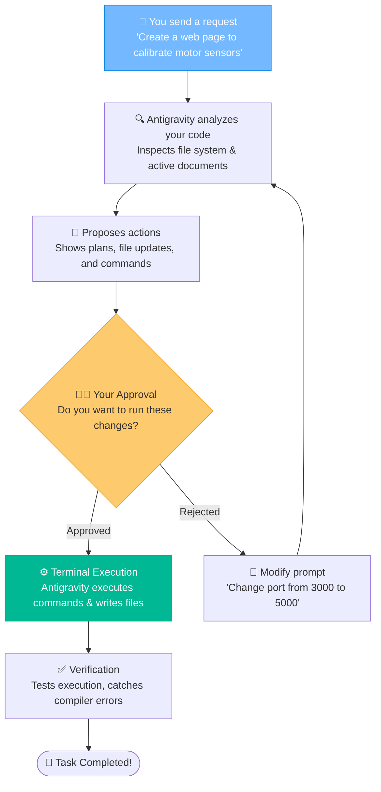
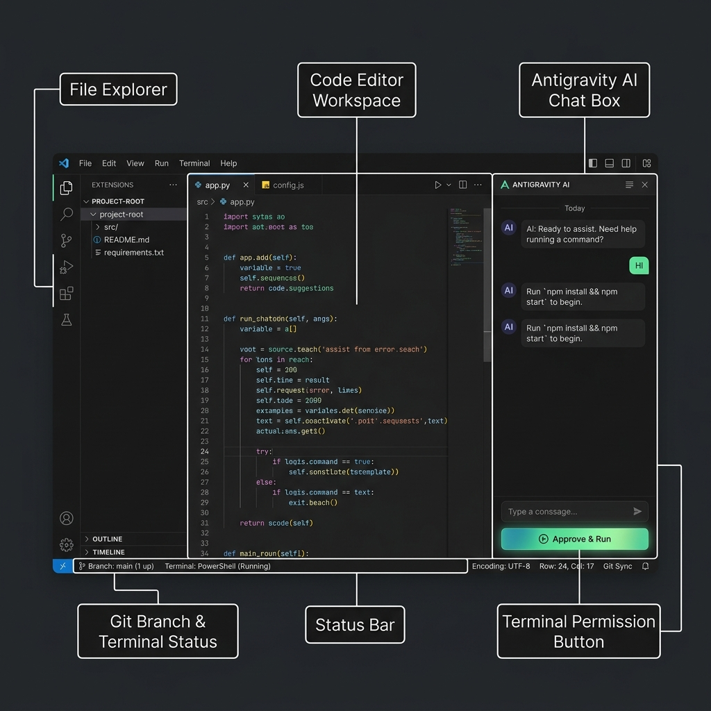

# 👾 Unleashing Antigravity: Your Agentic AI Coding Partner

Imagine hiring an intern who has memorized every coding book, documentation site, and StackOverflow post ever written. They write code at light speed, configure databases flawlessly, and don't steal your snacks from the breakroom. The only catch? They are so polite that they refuse to touch your keyboard or run a command unless you give them an explicit thumbs-up first. That is Antigravity: an agentic co-pilot that actually does the work while you play the role of the benevolent director.

### 🧭 The 5W 1H of Antigravity
*   **Who is this for?** Developers of all skill levels who want an active coding collaborator rather than a passive, copy-paste chatbot.
*   **What is it?** An agentic development assistant capable of reading workspace files, editing code directly, executing terminal commands, and fixing its own build bugs.
*   **Where does it operate?** Integrated directly inside your development workspace and local shell environment.
*   **When should you use it?** Throughout your entire development cycle—from planning architecture and setting up boilerplates to debugging and final tests.
*   **Why use it?** Because copying code blocks, writing terminal boilerplate, and fixing minor linter errors manually is a waste of your valuable coffee time.
*   **How does it work?** You explain what you want in natural language, review the proposed file changes and shell commands, approve them, and verify the results.

### 🚀 Antigravity IDE vs. Antigravity 2.0 (Agentic Evolution)

Here is a comparison of how the development experience has evolved:

| Feature / Capability | Antigravity IDE (v1.0) | Antigravity 2.0 (Current) |
| :--- | :--- | :--- |
| **Execution Paradigm** | Chat-based suggestions | Agentic autonomous operations |
| **Code Implementation** | Copy and paste manually | Direct file editing and creations |
| **Terminal Integration** | Run commands yourself | Runs terminal commands securely on your behalf |
| **Debugging Loop** | You copy error logs back and forth | Automatically intercepts and resolves compiler/linter errors |
| **State Monitoring** | Blind to workspace context | Monitors open files, cursors, and active terminals in real time |
| **Advanced Tools** | Static text outputs | Multi-agent support, slash command triggers, and scheduled loops |

---

## 🗺️ How Antigravity Works (The Collaboration Loop)

Here is a visual breakdown of how you and Antigravity collaborate on a task:

### 💡 Visual Walkthrough: The Antigravity Workspace Interface

To collaborate effectively with Antigravity, familiarize yourself with the layout of your agentic workspace:
*   **Code Editor Workspace**: The central workspace where your project source files are written, edited, and displayed.
*   **Antigravity AI Chat Box**: The chat pane on the right side where you communicate with the agent, issue prompts, and review proposed action plans.
*   **Terminal Permission Button**: The green **"Approve & Run"** button inside the AI chat plan. Clicking this authorizes the agent to write files and run shell commands in the background.
*   **Git Branch & Terminal Status**: The status bar at the bottom left showing your current active Git branch and the status of background terminal scripts.

---

## 💡 Humorous Prompts: How to Communicate with Antigravity

Antigravity understands natural language. To get the best out of it, treat it like an elite software engineer. 

### ❌ What NOT to say (Vague & Boring)
> *"Fix the bug in the app."* (Which app? What bug? Where is the error log?)

### ✅ What to say (Professional, Specific, and Fun)
> *"Antigravity, review my `motor.cpp` file. The loop starts lagging when speed exceeds 180. Write a safety dampener that caps acceleration spike rates, compile the code, and test if it builds cleanly."*

### 🤖 Fun Prompt Example: The Monday Slack Complaints Script
You want to write a Python script that checks the day of the week, and if it's Monday morning, it sends a randomized humorous complaint about Mondays to a webhook.
* **Prompt for Antigravity:**
  > *"Antigravity, write a Python script in `scratch/monday_vibes.py` that prints a random funny quote complaining about Mondays. Then run it in the terminal so I can laugh."*
* **Antigravity's Action:** Instantly writes the script, selects the python environment, launches the command, and prints the result:
  `"I need a coffee large enough to wash away my Monday responsibilities."`

---

## 🛠️ Essential Antigravity Slash Commands

You can use these special commands directly in the chat UI:

| Command | When to Use | Action |
|:---|:---|:---|
| `/goal` | Massive migrations / complex refactoring | Launches an autonomous mode where the agent works iteratively until the goal is fully achieved. |
| `/schedule` | Automation / cron jobs | Schedules recurring tasks (e.g., pulling latest code, running checks, compiling builds). |
| `/grill-me` | Alignment & Design | Initiates a friendly, interactive interview to align on design decisions before writing code. |

---

## 🕹️ Navigating Your Development Dashboard

Where would you like to go next? Click the buttons to load other guides:

  <a href="file:///Users/bharathkumara/Desktop/guides/readme.md" style="text-decoration:none;">
    <button style="background-color:#6c5ce7; color:white; border:none; padding:10px 18px; font-size:14px; border-radius:6px; cursor:pointer; font-weight:bold; margin:5px; box-shadow: 0 2px 4px rgba(0,0,0,0.1);">
      🏠 Back to Hub
    </button>
  </a>
  <a href="file:///Users/bharathkumara/Desktop/guides/vibecoding.md" style="text-decoration:none;">
    <button style="background-color:#00b894; color:white; border:none; padding:10px 18px; font-size:14px; border-radius:6px; cursor:pointer; font-weight:bold; margin:5px; box-shadow: 0 2px 4px rgba(0,0,0,0.1);">
      🧘‍♂️ Vibe Coding Guide
    </button>
  </a>

## 🛠️ Interactive Hands-on Challenge: Test Slash Commands

Let's try using Antigravity's advanced capabilities:
1. In the chat interface, type `/grill-me` and press Enter.
2. **Interact**: Respond to the automated interactive questions to plan out a simple app design of your choice.
3. Once you're done or want to stop, tell it: *"Let's cancel the interview."*
4. **Run a Task**: Ask Antigravity to run a quick local script check:
   > *"Antigravity, write a script in `scratch/check_time.py` that outputs the current local timestamp, and run it in the terminal."*
5. **Verify**: Approve the file edit and command execution to see the output printed.

---

### 👤 Author Details
* **Name**: Bharath Kumar A
* **GitHub**: [@bharathkumar000](https://github.com/bharathkumar000)
* **Email**: bharathece2006@gmail.com
<!-- streak-update: 2026-06-17 16:36:47 -->
