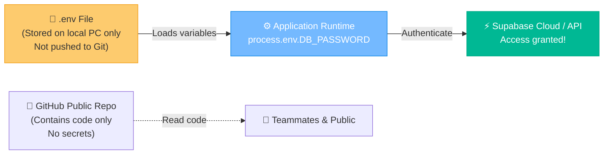
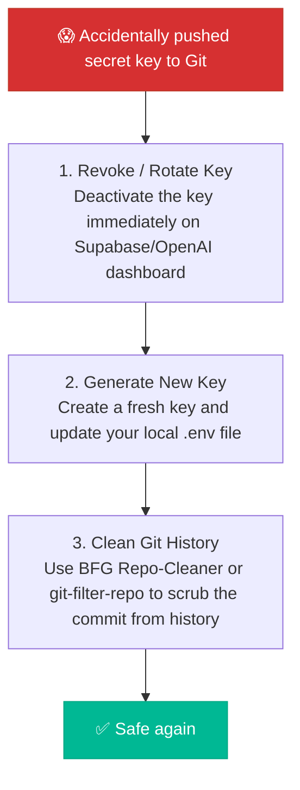

# 🔑 The Vault: API Key Management & Web Security Basics

Imagine building a smart door lock for your house, writing down the passcode on a sticky note, and pasting it onto a public billboard on the street. 

That is exactly what you do when you **hardcode API keys, database passwords, or secret credentials** directly in your source code and push it to a public GitHub repository. Within minutes, automated bots will scrape your code, steal your keys, and potentially run up thousands of dollars in server bills.

This guide is your step-by-step blueprint to keeping your secrets safe.

---

## 🗺️ How Environment Variables Work

Instead of putting passwords in your code, you store them in a local `.env` (Environment) file that never leaves your machine. Your application reads these secrets from the system memory at runtime:



---

## 🚀 Setup Guide: Using `.env` Files

Here is the professional workflow for managing credentials in a web project:

### Step 1: Create a `.env` File (On your computer)
Create a file named `.env` in the root of your project:
```env
SUPABASE_URL="https://abc123xyz.supabase.co"
SUPABASE_SERVICE_ROLE_KEY="eyJhbGciOi..."
DATABASE_PASSWORD="super-secret-password-123"
```
> [!WARNING]
> Never, ever commit this file to GitHub!

### Step 2: Create a `.env.example` File (For your team)
Create a placeholder file called `.env.example` and push *this* to GitHub. It tells your teammates which keys they need to set up locally:
```env
# Template - Replace with your actual credentials
SUPABASE_URL="your-supabase-url"
SUPABASE_SERVICE_ROLE_KEY="your-service-role-key"
DATABASE_PASSWORD="your-database-password"
```

### Step 3: Add `.env` to `.gitignore`
Make sure your `.gitignore` file contains the line `.env` so Git ignores it:
```gitignore
# Environment variables
.env
.env.local
.env.development.local
```

---

## 🎭 The "Oh No, I Leaked It!" Emergency Guide

If you accidentally commit an API key to a public GitHub repository, follow these steps immediately:



* **Why standard git delete doesn't work**: Simply deleting the file and making a new commit saying *"remove secrets"* doesn't help because the secret remains visible in your **git history**! You must revoke the key on the provider's dashboard immediately.

---

## 🕹️ Vault Navigation Dashboard

Ready to configure your project parameters? Click the dashboard buttons to proceed:

<div align="center" style="margin: 20px 0;">
  <a href="file:///Users/bharathkumara/Desktop/guides/supabase.md" style="text-decoration:none;">
    <button style="background-color:#e17055; color:white; border:none; padding:10px 18px; font-size:14px; border-radius:6px; cursor:pointer; font-weight:bold; margin:5px; box-shadow: 0 2px 4px rgba(0,0,0,0.1);">
      ⚡ Setup Supabase Database
    </button>
  </a>
  <a href="file:///Users/bharathkumara/Desktop/guides/vercel.md" style="text-decoration:none;">
    <button style="background-color:#0984e3; color:white; border:none; padding:10px 18px; font-size:14px; border-radius:6px; cursor:pointer; font-weight:bold; margin:5px; box-shadow: 0 2px 4px rgba(0,0,0,0.1);">
      ☁️ Set Vercel Env Vars
    </button>
  </a>
</div>
