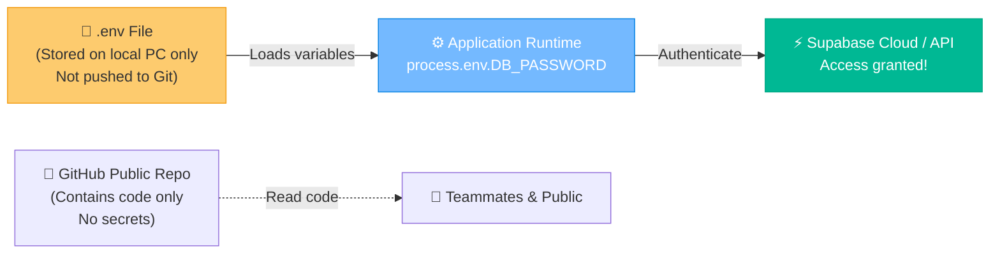
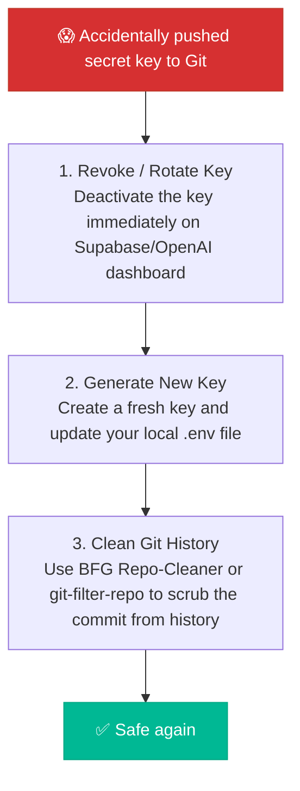

# 🔑 The Vault: API Key Management & Web Security Basics

Imagine you built a state-of-the-art home security vault with steel doors and laser defense grids, but then you wrote the vault passcode on a neon pink sticky note and taped it to a billboard in the middle of Times Square. That is exactly what you do when you hardcode your API keys, database passwords, or secret credentials directly in your source code and push it to GitHub. Within seconds, automated crawler bots will harvest your keys, spin up illegal crypto miners, and leave you with a bill that could buy a small country. This guide is your step-by-step blueprint to keeping your secrets safe.

### 🧭 The 5W 1H of API Key Security
*   **Who is this for?** Any developer working with external APIs, cloud databases, or sensitive service connections.
*   **What is it?** The process of securing API credentials using local environment variables (`.env` files) that never touch your public code repositories.
*   **Where does it live?** Stored in a hidden file in your local root directory, and safely declared inside hosting dashboards in production.
*   **When should you use it?** The very millisecond you generate your first API token, access key, or database password.
*   **Why does it matter?** Because leaking secrets online results in immediate financial loss, hijacked services, and a lot of embarrassing emails from your cloud provider.
*   **How do you do it?** Store secrets in a local, Git-ignored `.env` file, read them at runtime using environment configs, and share a safe `.env.example` template with your team.

---

## 🗺️ How Environment Variables Work

Instead of putting passwords in your code, you store them in a local `.env` (Environment) file that never leaves your machine. Your application reads these secrets from the system memory at runtime:



---

## 🚀 Setup Guide: Using `.env` Files

Here is the professional workflow for managing credentials in a web project:

### Step 1: Create a `.env` File (On your computer)
Create a file named `.env` in the root of your project:
```env
SUPABASE_URL="https://abc123xyz.supabase.co"
SUPABASE_SERVICE_ROLE_KEY="eyJhbGciOi..."
DATABASE_PASSWORD="super-secret-password-123"
```
> [!WARNING]
> Never, ever commit this file to GitHub!

### Step 2: Create a `.env.example` File (For your team)
Create a placeholder file called `.env.example` and push *this* to GitHub. It tells your teammates which keys they need to set up locally:
```env
# Template - Replace with your actual credentials
SUPABASE_URL="your-supabase-url"
SUPABASE_SERVICE_ROLE_KEY="your-service-role-key"
DATABASE_PASSWORD="your-database-password"
```

### Step 3: Add `.env` to `.gitignore`
Make sure your `.gitignore` file contains the line `.env` so Git ignores it:
```gitignore
# Environment variables
.env
.env.local
.env.development.local
```

---

## 🎭 The "Oh No, I Leaked It!" Emergency Guide

If you accidentally commit an API key to a public GitHub repository, follow these steps immediately:



* **Why standard git delete doesn't work**: Simply deleting the file and making a new commit saying *"remove secrets"* doesn't help because the secret remains visible in your **git history**! You must revoke the key on the provider's dashboard immediately.

---

## 🕹️ Vault Navigation Dashboard

Ready to configure your project parameters? Click the dashboard buttons to proceed:

<div align="center" style="margin: 20px 0;">
  <a href="file:///Users/bharathkumara/Desktop/guides/supabase.md" style="text-decoration:none;">
    <button style="background-color:#e17055; color:white; border:none; padding:10px 18px; font-size:14px; border-radius:6px; cursor:pointer; font-weight:bold; margin:5px; box-shadow: 0 2px 4px rgba(0,0,0,0.1);">
      ⚡ Setup Supabase Database
    </button>
  </a>
  <a href="file:///Users/bharathkumara/Desktop/guides/vercel.md" style="text-decoration:none;">
    <button style="background-color:#0984e3; color:white; border:none; padding:10px 18px; font-size:14px; border-radius:6px; cursor:pointer; font-weight:bold; margin:5px; box-shadow: 0 2px 4px rgba(0,0,0,0.1);">
      ☁️ Set Vercel Env Vars
    </button>
  </a>
</div>

## 🛠️ Interactive Hands-on Challenge: Protect a Secret

Let's practice securing credentials in a local workspace:
1. Open **Antigravity Chat**.
2. Run this prompt to create a dummy secret file:
   > *"Antigravity, write a dummy credentials file in the scratch folder named `scratch/mock_api.env` containing: `MOCK_API_KEY=\"fake-keys-12345\"`"*
3. **Verify**: Ensure the file is successfully created.
4. **Git Check**: Now, let's make sure Git ignores it. Ask Antigravity:
   > *"Add `scratch/mock_api.env` to the project's `.gitignore` file, then run git status to make sure the secret file is ignored and doesn't get tracked."*
5. **Verify**: Check the command output to verify `mock_api.env` is hidden from Git tracking!

---

### 👤 Author Details
* **Name**: Bharath Kumar A
* **GitHub**: [@bharathkumar000](https://github.com/bharathkumar000)
* **Email**: bharathece2006@gmail.com
