# 🎓 The Ultimate Git & GitHub Guide: From Novice to Collaborative Developer

Imagine you and a group of friends trying to write a book together by sharing a single Microsoft Word document via email attachments. Alice writes chapter 1 and emails it to Bob. Bob deletes Alice's chapter by mistake because he was working on a version from last Tuesday. Meanwhile, Charlie has created a folder full of files like `book_final_v3_ACTUALLY_FINAL_NO_REALLY.docx`. Within days, friendships are ruined and the book is a chaotic mess. Git is the magical time-machine and referee that stops this tragedy, keeping track of every single line edited, who wrote what, and preventing group chat arguments.

### 🧭 The 5W 1H of Git & GitHub
*   **Who is this for?** Developers collaborating in teams or individuals who want to track their code progress safely.
*   **What is it?** A local version control software program (Git) and a cloud hosting platform (GitHub) for syncing, tracking, and sharing code.
*   **Where does it live?** Git operates locally on your machine, while GitHub hosts your remote code repositories in the cloud.
*   **When should you use it?** From the very first line of code you write in a project, all the way to production releases and updates.
*   **Why use it?** Because manual folder backups get messy instantly, code overwrites destroy progress, and tracking bugs without git history is nearly impossible.
*   **How do you use it?** Initialize a local repository, use commits to save snapshots, push branches to GitHub, and collaborate via Pull Requests.

---

## 🛠️ Interactive Hands-on Challenge: Search, Fork, and Clone

Let's practice collaborating on a remote GitHub project:
1. Open your web browser and go to [github.com](https://github.com).
2. In the top-left search bar, search for: `bharathkumar000/guides`
3. Click on the repository in the search results to open it.
4. Click the **"Fork"** button in the top-right corner, then click **"Create Fork"** to copy the repository under your personal GitHub namespace.
5. In your new fork repository page, click the green **"Code"** button and copy the HTTPS URL (e.g. `https://github.com/YOUR-USERNAME/guides.git`).

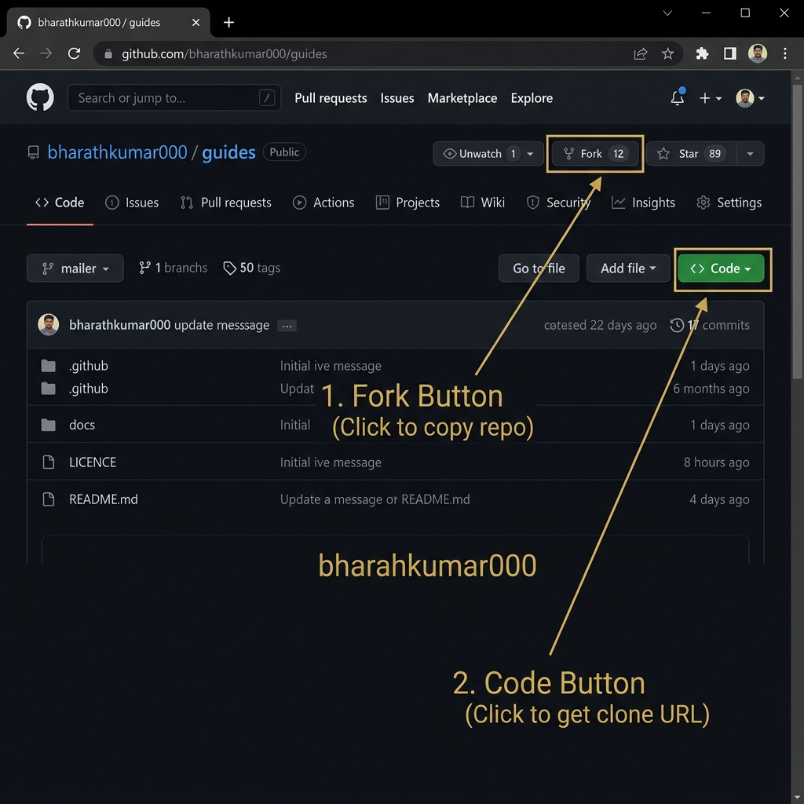

6. Open **Antigravity Chat** and send this request:
   > *"Antigravity, clone my forked guides repository locally using the copied URL to my local workspace, and run git status."*
7. **Verify**: Ensure the repository is successfully cloned to your machine!

---

## 🗺️ Master Roadmap
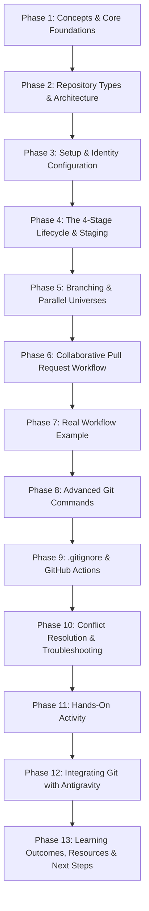
```mermaid
graph TD
    A[Phase 1: Concepts & Core Foundations] --> B[Phase 2: Repository Types & Architecture]
    B --> C[Phase 3: Setup & Identity Configuration]
    C --> D[Phase 4: The 4-Stage Lifecycle & Staging]
    D --> E[Phase 5: Branching & Parallel Universes]
    E --> F[Phase 6: Collaborative Pull Request Workflow]
    F --> F2[Phase 7: Real Workflow Example]
    F2 --> G[Phase 8: Advanced Git Commands]
    G --> G2[Phase 9: .gitignore & GitHub Actions]
    G2 --> H[Phase 10: Conflict Resolution & Troubleshooting]
    H --> H2[Phase 11: Hands-On Activity]
    H2 --> I[Phase 12: Integrating Git with Antigravity]
    I --> J[Phase 13: Learning Outcomes, Resources & Next Steps]
```

---

## 📁 Table of Contents
1. [Phase 1: Foundations of Version Control (Git vs. GitHub)](#phase-1-foundations-of-version-control-git-vs-github)
2. [Phase 2: Types of Repositories & Their Architecture](#phase-2-types-of-repositories-their-architecture)
3. [Phase 3: First-Time Setup & Configuration](#phase-3-first-time-setup--configuration)
4. [Phase 4: The Three Local Areas & Staging Lifecycle](#phase-4-the-three-local-areas--staging-lifecycle)
5. [Phase 5: Branching & Isolated Development Environments](#phase-5-branching--isolated-development-environments)
6. [Phase 6: Collaborative Workflows & Pull Requests](#phase-6-collaborative-workflows--pull-requests)
7. [Phase 7: Real Workflow Example — Motor Control](#phase-7-real-workflow-example--motor-control)
8. [Phase 8: Advanced Git Operations (Cherry-Picking, Rebase, Stash & Bisect)](#phase-8-advanced-git-operations-cherry-picking-rebase-stash--bisect)
9. [Phase 9: .gitignore & GitHub Actions (CI/CD)](#phase-9-gitignore--github-actions-cicd)
10. [Phase 10: Troubleshooting Common Mistakes & Resolving Merge Conflicts](#phase-10-troubleshooting-common-mistakes--resolving-merge-conflicts)
11. [Phase 11: Hands-On Activity — Build Your First Repository](#phase-11-hands-on-activity--build-your-first-repository)
12. [Phase 12: Unleashing Git with Antigravity Agent & Terminal](#phase-12-unleashing-git-with-antigravity-agent--terminal)
13. [Phase 13: Learning Outcomes, Tools Used & Next Steps](#phase-13-learning-outcomes-tools-used--next-steps)

---

## Phase 1: Foundations of Version Control (Git vs. GitHub)

### The Problem: The Chaos of Uncontrolled Collaboration
Imagine a robotics team consisting of four developers—BHARATH all working on the control software for a humanoid robot. 
* **Without Git**, BHARATH might open a file named `motor.cpp` to optimize the pulse-width modulation (PWM) frequency. 
* Simultaneously, SURESH opens the exact same `motor.cpp` to implement proportional-integral-derivative (PID) tuning.
* When BHARATH saves his changes via a shared file-sharing drive (like Google Drive) or over Slack, he overwrites SURESH's progress. 
* Alternatively, to prevent overwrites, the team resorts to manual file duplication, resulting in a chaotic directory structure filled with files like:
  ```text
  motor_final.cpp
  motor_final_v2.cpp
  motor_ACTUALLY_FINAL.cpp
  motor_please_use_this_one.cpp
  ```
This manual backup method is error-prone, provides zero history of who made which change, and makes tracking down bugs nearly impossible.

### 📊 Flowchart: What Happens Without Version Control?
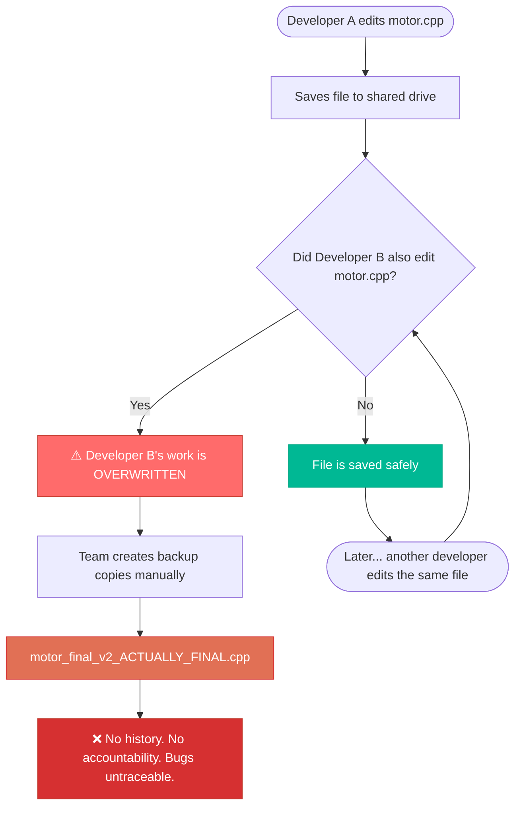
```mermaid
flowchart TD
    Start(["Developer A edits motor.cpp"]) --> Save["Saves file to shared drive"]
    Save --> Q{"Did Developer B also edit motor.cpp?"}
    Q -->|Yes| Overwrite["⚠️ Developer B's work is OVERWRITTEN"]
    Q -->|No| OK["File is saved safely"]
    Overwrite --> Panic["Team creates backup copies manually"]
    Panic --> Chaos["motor_final_v2_ACTUALLY_FINAL.cpp"]
    Chaos --> Lost["❌ No history. No accountability. Bugs untraceable."]
    OK --> Later(["Later... another developer edits the same file"])
    Later --> Q

    style Overwrite fill:#ff6b6b,stroke:#c0392b,color:#fff
    style Chaos fill:#e17055,stroke:#d63031,color:#fff
    style Lost fill:#d63031,stroke:#c0392b,color:#fff
    style OK fill:#00b894,stroke:#00a884,color:#fff
```

### The Solution: Distributed Version Control Systems (DVCS)
Version control solves this chaos by tracking every line of code edited, added, or deleted. It logs **who** changed the file, **when** they changed it, and **why** they changed it. If a new edit introduces a bug that causes the robot's arm to malfunction, Git allows the team to pinpoint the exact commit that introduced the bug and instantly roll the project back to a stable state.

### 📊 Flowchart: How Version Control Saves the Day
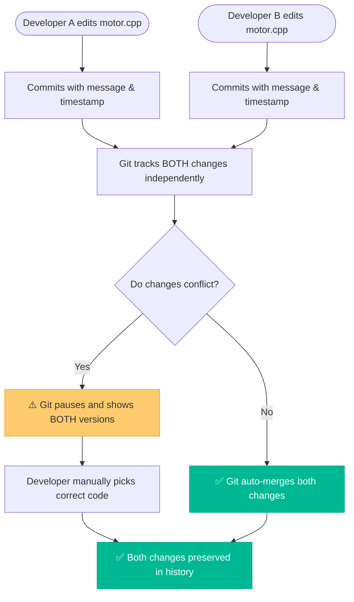
```mermaid
flowchart TD
    A(["Developer A edits motor.cpp"]) --> Commit1["Commits with message & timestamp"]
    B(["Developer B edits motor.cpp"]) --> Commit2["Commits with message & timestamp"]
    Commit1 --> Git["Git tracks BOTH changes independently"]
    Commit2 --> Git
    Git --> Merge{"Do changes conflict?"}
    Merge -->|No| AutoMerge["✅ Git auto-merges both changes"]
    Merge -->|Yes| Manual["⚠️ Git pauses and shows BOTH versions"]
    Manual --> Resolve["Developer manually picks correct code"]
    Resolve --> Done["✅ Both changes preserved in history"]
    AutoMerge --> Done

    style Done fill:#00b894,stroke:#00a884,color:#fff
    style AutoMerge fill:#00b894,stroke:#00a884,color:#fff
    style Manual fill:#fdcb6e,stroke:#f39c12,color:#333
```

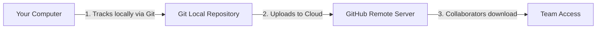
```mermaid
graph LR
    User[Your Computer] -->|1. Tracks locally via Git| GitLocal[Git Local Repository]
    GitLocal -->|2. Uploads to Cloud| GitHub[GitHub Remote Server]
    GitHub -->|3. Collaborators download| Team[Team Access]
```

### Git vs. GitHub: Clearing Up the Confusion
Many beginners conflate Git and GitHub, but they are entirely different components of a shared ecosystem:

* **Git**: A local, open-source version control software program installed directly on your machine. Git runs entirely inside your computer's terminal (or shell) and operates offline. It manages your project's history by taking snapshots (known as commits) of your local working directory and storing them in a hidden folder named `.git`.
* **GitHub**: A cloud-based hosting service and collaboration platform accessed via a web browser. It hosts copy-paste remote instances of your Git repositories in the cloud. Beyond code hosting, GitHub introduces collaboration features that Git lacks natively, such as pull requests, code reviews, issue trackers, user permission management, security vulnerability alerts, and automated workflows (GitHub Actions).

> [!IMPORTANT]
> Git is the engine that drives version control locally; GitHub is the garage where your team parks their shared engines to collaborate, review, and plan.

---

## Phase 2: Types of Repositories & Their Architecture

In Git, a repository (often called a "repo") is the digital storage container for your project. However, repositories exist in different physical and logical states depending on where they are stored and how they are linked.

### 📊 Flowchart: Which Type of Repository Do You Have?
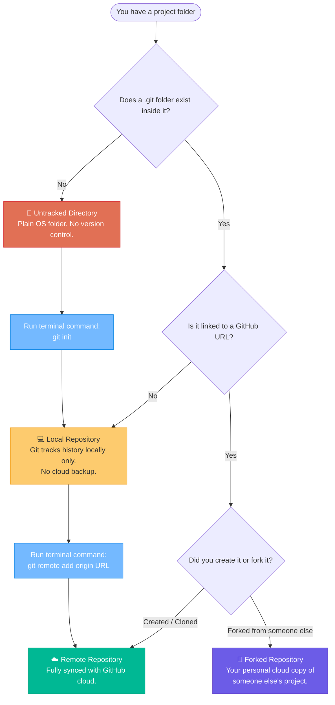
```mermaid
flowchart TD
    Start(["You have a project folder"]) --> Q1{"Does a .git folder exist inside it?"}
    Q1 -->|No| Untracked["📁 Untracked Directory\nPlain OS folder. No version control."]
    Q1 -->|Yes| Q2{"Is it linked to a GitHub URL?"}
    Q2 -->|No| Local["💻 Local Repository\nGit tracks history locally only.\nNo cloud backup."]
    Q2 -->|Yes| Q3{"Did you create it or fork it?"}
    Q3 -->|"Created / Cloned"| Remote["☁️ Remote Repository\nFully synced with GitHub cloud."]
    Q3 -->|"Forked from someone else"| Forked["🍴 Forked Repository\nYour personal cloud copy of\nsomeone else's project."]

    Untracked --> Action1["Run terminal command:\ngit init"]
    Action1 --> Local
    Local --> Action2["Run terminal command:\ngit remote add origin URL"]
    Action2 --> Remote

    style Untracked fill:#e17055,stroke:#d63031,color:#fff
    style Local fill:#fdcb6e,stroke:#f39c12,color:#333
    style Remote fill:#00b894,stroke:#00a884,color:#fff
    style Forked fill:#6c5ce7,stroke:#5f3dc4,color:#fff
    style Action1 fill:#74b9ff,stroke:#0984e3,color:#fff
    style Action2 fill:#74b9ff,stroke:#0984e3,color:#fff
```

### 1. Untracked Directory (Plain Local Folder)
Before Git enters the picture, your project is a standard operating system directory. This folder is managed solely by your OS filesystem (Finder on macOS or Explorer on Windows). Git is completely unaware of its existence, meaning no snapshots can be taken, no history is recorded, and deleted files are lost forever.

### 2. Local Repository (Git Initialized)
When you run the command to initialize a repository, Git creates a hidden directory called `.git` inside your project folder. This metadata folder contains Git's internal databases, compression algorithms, configuration files, and object history. Once initialized, the directory is a **Local Repository**. You can stage files, write commit messages, and travel back in time through your code's history—but these records exist strictly on your hard drive. If your computer crashes, your work is lost.

### 3. Remote Repository (GitHub Cloud Instance)
A **Remote Repository** is hosted on GitHub's global cloud servers. By linking your Local Repository to a Remote Repository, you create a cloud-based backup. Pushing commits to GitHub uploads your local `.git` history to the remote server, making your code accessible to collaborators anywhere in the world.

---

### The Architecture: Clone vs. Fork
When you want to download and work on code hosted on GitHub, you will use either **Cloning** or **Forking**. Understanding the difference is vital for clean team collaboration:

| Feature | Clone (`git clone`) | Fork (GitHub Web UI Feature) |
| :--- | :--- | :--- |
| **What is it?** | A copy of a remote repo downloaded directly onto your local machine. | A duplicate copy of someone else's remote repo created on your personal GitHub account. |
| **Where does it live?** | On your local hard drive. | In the GitHub cloud, under your user namespace. |
| **Write Access** | Requires direct collaborator permissions to push changes back to the original. | You have full write permissions on your fork because you own it. |
| **Usage Scenario** | Standard workflow for close team members collaborating on a shared repository. | Standard workflow for contributing to open-source projects you do not own. |

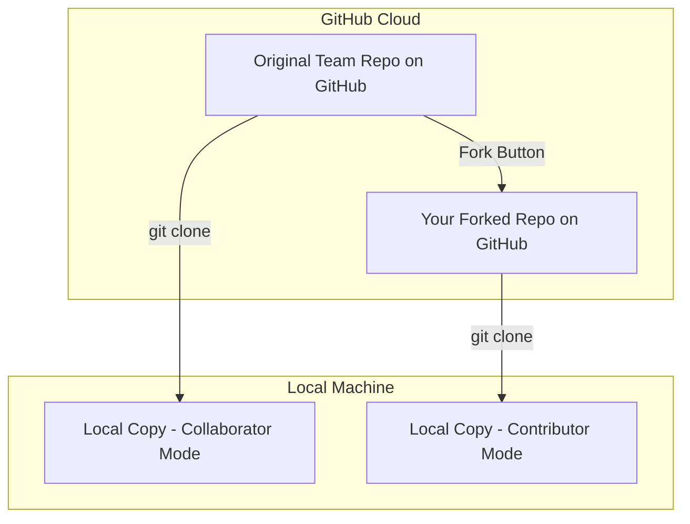
```mermaid
graph TD
    subgraph GitHub Cloud
        Orig[Original Team Repo on GitHub] -->|Fork Button| Forked[Your Forked Repo on GitHub]
    end
    subgraph Local Machine
        Orig -->|git clone| Local1[Local Copy - Collaborator Mode]
        Forked -->|git clone| Local2[Local Copy - Contributor Mode]
    end
```

---

## Phase 3: First-Time Setup & Configuration

Before you start writing code and creating commits, you must tell Git who you are. This ensures that every snapshot you save is stamped with your name and email address, establishing accountability and identity in team projects.

### 📊 Flowchart: First-Time Git Setup Decision Tree
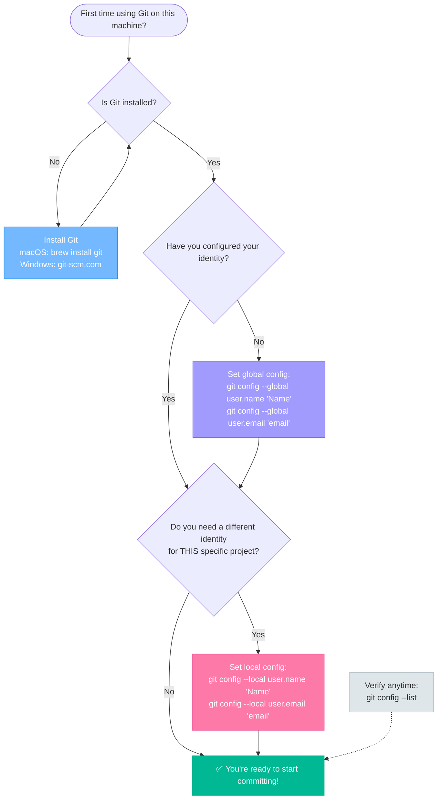
```mermaid
flowchart TD
    Start(["First time using Git on this machine?"]) --> Q1{"Is Git installed?"}
    Q1 -->|No| Install["Install Git\nmacOS: brew install git\nWindows: git-scm.com"]
    Install --> Q1
    Q1 -->|Yes| Q2{"Have you configured your identity?"}
    Q2 -->|No| Global["Set global config:\ngit config --global user.name 'Name'\ngit config --global user.email 'email'"]
    Q2 -->|Yes| Q3{"Do you need a different identity\nfor THIS specific project?"}
    Q3 -->|Yes| Local["Set local config:\ngit config --local user.name 'Name'\ngit config --local user.email 'email'"]
    Q3 -->|No| Ready["✅ You're ready to start committing!"]
    Global --> Q3
    Local --> Ready

    Verify["Verify anytime:\ngit config --list"] -.-> Ready

    style Install fill:#74b9ff,stroke:#0984e3,color:#fff
    style Global fill:#a29bfe,stroke:#6c5ce7,color:#fff
    style Local fill:#fd79a8,stroke:#e84393,color:#fff
    style Ready fill:#00b894,stroke:#00a884,color:#fff
    style Verify fill:#dfe6e9,stroke:#b2bec3,color:#333
```

### Global vs. Local Configuration
* **Global Config (`--global`)**: Applies to every single repository you create or work on across your entire computer. It is stored in your user profile home folder (e.g., `~/.gitconfig` on macOS).
* **Local Config (`--local`)**: Applies only to the specific repository directory you are currently working in. It overrides the global configuration for that project only and is stored within the project's `.git/config` file. This is highly useful if you use a personal PC but need to use a company or school-specific email address for a single robot project.

### Commands & Explanations

#### Configure Global Identity
```bash
git config --global user.name "<your github user name>" for example: BHARATH Kumar A
git config --global user.email "<your email linked to github>" for example: "BHARATH@gmail.com"
```
* **What it does**: Binds the name "BHARATH Kumar A" and the email "BHARATH@gmail.com" to every Git operation on your system.
* **Why to use it**: Must be executed at least once on a new machine before you make your first commit, otherwise Git will raise a warning and attempt to guess your username.

#### Configure Local Identity (Run inside a specific repo directory)
```bash
git config --local user.name "<your github user name>"
git config --local user.email "<your email linked to github>"
```
* **What it does**: Overrides global user details for the active repository, tagging commits from this repo with "BHARATH".

#### Verify Configurations
```bash
git config --list
```
* **What it does**: Outputs a detailed text list of all configurations Git is currently reading (including editor preferences, alias definitions, credentials, and identities).

---

## Phase 4: The Three Local Areas & Staging Lifecycle

To successfully use Git, you must understand its local internal pipeline. Rather than saving changes straight to your project history, Git uses three distinct zones to organize your edits.

```text
+-----------------------+      git add .     +-----------------------+
|   Working Directory   |  --------------->  |     Staging Area      |
|  (Modified raw files) |                    |  (Queued changes)     |
+-----------------------+                    +-----------------------+
                                                         |
                                                         | git commit -m "..."
                                                         v
+-----------------------+      git push      +-----------------------+
|   Remote Repository   |  <---------------  |   Local Repository    |
|   (GitHub in Cloud)   |                    | (.git directory history)|
+-----------------------+                    +-----------------------+
```

### 📊 Flowchart: Complete File State Lifecycle in Git
Every file in your project passes through a series of states. This flowchart shows the full journey a file takes from creation to being pushed to the cloud:

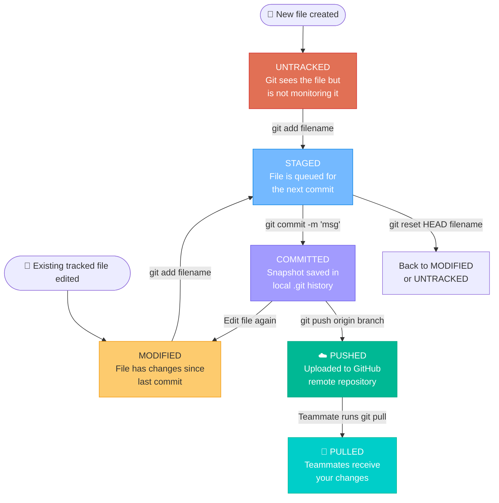
```mermaid
flowchart TD
    New(["📄 New file created"]) --> Untracked["UNTRACKED\nGit sees the file but\nis not monitoring it"]
    Existing(["📝 Existing tracked file edited"]) --> Modified["MODIFIED\nFile has changes since\nlast commit"]

    Untracked -->|"git add filename"| Staged["STAGED\nFile is queued for\nthe next commit"]
    Modified -->|"git add filename"| Staged

    Staged -->|"git reset HEAD filename"| Untracked2["Back to MODIFIED\nor UNTRACKED"]
    Staged -->|"git commit -m 'msg'"| Committed["COMMITTED\nSnapshot saved in\nlocal .git history"]

    Committed -->|"git push origin branch"| Pushed["☁️ PUSHED\nUploaded to GitHub\nremote repository"]
    Committed -->|"Edit file again"| Modified

    Pushed -->|"Teammate runs git pull"| Pulled["👥 PULLED\nTeammates receive\nyour changes"]

    style Untracked fill:#e17055,stroke:#d63031,color:#fff
    style Modified fill:#fdcb6e,stroke:#f39c12,color:#333
    style Staged fill:#74b9ff,stroke:#0984e3,color:#fff
    style Committed fill:#a29bfe,stroke:#6c5ce7,color:#fff
    style Pushed fill:#00b894,stroke:#00a884,color:#fff
    style Pulled fill:#00cec9,stroke:#00b894,color:#fff
```

### 📊 Flowchart: "Should I Commit Now?" Decision Tree
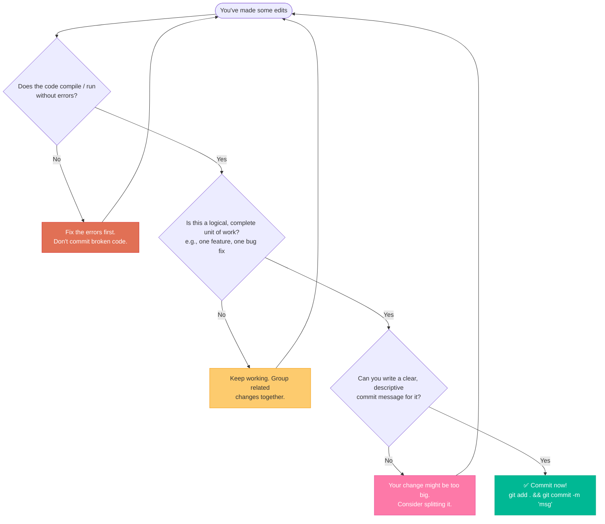
```mermaid
flowchart TD
    Start(["You've made some edits"]) --> Q1{"Does the code compile / run\nwithout errors?"}
    Q1 -->|No| Fix["Fix the errors first.\nDon't commit broken code."]
    Fix --> Start
    Q1 -->|Yes| Q2{"Is this a logical, complete unit of work?\ne.g., one feature, one bug fix"}
    Q2 -->|No| Keep["Keep working. Group related\nchanges together."]
    Keep --> Start
    Q2 -->|Yes| Q3{"Can you write a clear, descriptive\ncommit message for it?"}
    Q3 -->|No| Split["Your change might be too big.\nConsider splitting it."]
    Split --> Start
    Q3 -->|Yes| Commit["✅ Commit now!\ngit add . && git commit -m 'msg'"]

    style Fix fill:#e17055,stroke:#d63031,color:#fff
    style Keep fill:#fdcb6e,stroke:#f39c12,color:#333
    style Split fill:#fd79a8,stroke:#e84393,color:#fff
    style Commit fill:#00b894,stroke:#00a884,color:#fff
```

### The 4 Stages Explained
1. **Working Directory**: The actual folder on your computer's filesystem containing your source code. When you modify files in an IDE, those modifications live in the Working Directory. At this stage, files are either *Untracked* (brand new files Git doesn't watch yet) or *Modified* (existing files with changes that haven't been staged).
2. **Staging Area (Index)**: A digital staging ground or "loading dock." Before committing, you must explicitly state which modifications should be included in your next snapshot. Files in the Staging Area are marked as *Staged*. This lets you fine-tune what goes into a commit, allowing you to split massive edits into clean, logical snapshots.
3. **Local Repository (`.git` directory)**: The local database where Git permanently stores compressed snapshots of your project. Once you commit, those changes are stored safely in your local history, complete with a unique SHA-1 hash identifier.
4. **Remote Repository**: The version of your project stored on GitHub. Running a push moves your committed snapshots from your local machine to the cloud.

---

### Phase 4 Commands

#### `git init`
* **Syntax**: `git init`
* **What it does**: Initializes an empty Git repository in your current working directory, creating the hidden `.git` folder.
* **Example**:
  ```bash
  mkdir robotics-project
  cd robotics-project
  git init
  ```

#### `git status`
* **Syntax**: `git status`
* **What it does**: Scans the Working Directory and Staging Area, displaying which files are modified, which are staged, and which are currently untracked.
* **Why to use it**: You should run `git status` constantly—before staging, before committing, and after pulling. It is your primary dashboard.

#### `git add`
* **Syntax**: `git add <file-name>` or `git add .`
* **What it does**: Moves modifications from the Working Directory to the Staging Area. Specifying `.` stages all modified and untracked files in the current folder and subfolders.
* **Example**:
  ```bash
  git add motor.cpp            # Stages only motor.cpp
  git add .                    # Stages everything
  ```

#### `git commit`
* **Syntax**: `git commit -m "<descriptive-message>"`
* **What it does**: Saves the staged snapshots to the Local Repository history. The `-m` flag specifies the commit message, which must be enclosed in quotes.
* **Example**:
  ```bash
  git commit -m "Add PID controller tuning for motor locomotion"
  ```

> [!TIP]
> **Commit Message Best Practices**: Write commit messages in the imperative mood (e.g., "Add feature" instead of "Added feature" or "Adds feature"). This matches Git's internal commit generation style (e.g., "Merge branch..."). Keep the summary line under 50 characters, and explain *what* changed and *why*.

---

## Phase 5: Branching & Isolated Development Environments

### What is a Branch?
A **branch** in Git is a lightweight pointer to a specific commit in your repository history. In practice, branches are parallel universes. By default, every repository starts with a primary branch (historically called `master`, now standardized as `main`). 

If BHARATH wants to write experimental navigation logic, doing so directly on `main` is dangerous. If the code breaks, the entire team's build is broken. Instead, BHARATH branches off of `main` into a branch named `feature/navigation`. He can write code, run experiments, and break things without affecting his teammates' work on `main`.

```text
              C3 ---- C4 (feature/navigation)
             /
C1 -------- C2 (main)
```

### 📊 Flowchart: Branch Naming Strategy & When to Branch
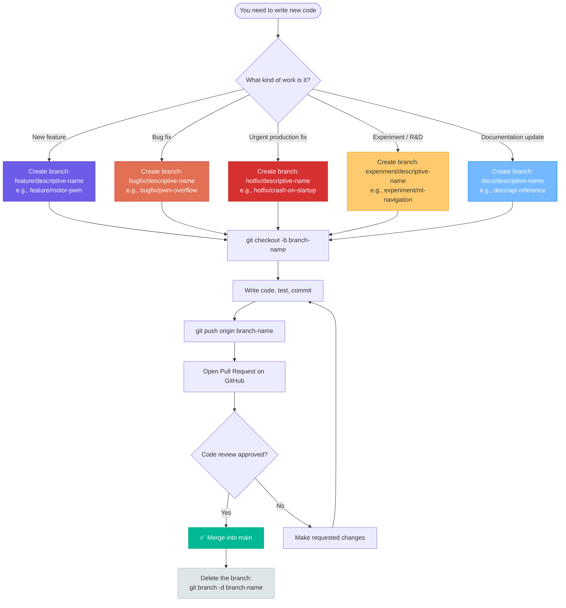
```mermaid
flowchart TD
    Start(["You need to write new code"]) --> Q1{"What kind of work is it?"}
    Q1 -->|"New feature"| Feature["Create branch:\nfeature/descriptive-name\ne.g., feature/motor-pwm"]
    Q1 -->|"Bug fix"| Bugfix["Create branch:\nbugfix/descriptive-name\ne.g., bugfix/pwm-overflow"]
    Q1 -->|"Urgent production fix"| Hotfix["Create branch:\nhotfix/descriptive-name\ne.g., hotfix/crash-on-startup"]
    Q1 -->|"Experiment / R&D"| Experiment["Create branch:\nexperiment/descriptive-name\ne.g., experiment/ml-navigation"]
    Q1 -->|"Documentation update"| Docs["Create branch:\ndocs/descriptive-name\ne.g., docs/api-reference"]

    Feature --> Cmd["git checkout -b branch-name"]
    Bugfix --> Cmd
    Hotfix --> Cmd
    Experiment --> Cmd
    Docs --> Cmd

    Cmd --> Work["Write code, test, commit"]
    Work --> Push["git push origin branch-name"]
    Push --> PR["Open Pull Request on GitHub"]
    PR --> Review{"Code review approved?"}
    Review -->|Yes| Merge["✅ Merge into main"]
    Review -->|No| Revise["Make requested changes"]
    Revise --> Work
    Merge --> Cleanup["Delete the branch:\ngit branch -d branch-name"]

    style Feature fill:#6c5ce7,stroke:#5f3dc4,color:#fff
    style Bugfix fill:#e17055,stroke:#d63031,color:#fff
    style Hotfix fill:#d63031,stroke:#c0392b,color:#fff
    style Experiment fill:#fdcb6e,stroke:#f39c12,color:#333
    style Docs fill:#74b9ff,stroke:#0984e3,color:#fff
    style Merge fill:#00b894,stroke:#00a884,color:#fff
    style Cleanup fill:#dfe6e9,stroke:#b2bec3,color:#333
```

### 📊 Flowchart: Merge vs. Rebase — Choosing Your Integration Strategy
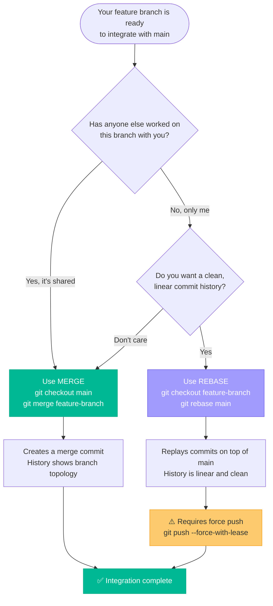
```mermaid
flowchart TD
    Start(["Your feature branch is ready\nto integrate with main"]) --> Q1{"Has anyone else worked on\nthis branch with you?"}
    Q1 -->|"Yes, it's shared"| Merge["Use MERGE\ngit checkout main\ngit merge feature-branch"]
    Q1 -->|"No, only me"| Q2{"Do you want a clean,\nlinear commit history?"}
    Q2 -->|Yes| Rebase["Use REBASE\ngit checkout feature-branch\ngit rebase main"]
    Q2 -->|"Don't care"| Merge

    Merge --> MergeResult["Creates a merge commit\nHistory shows branch topology"]
    Rebase --> RebaseResult["Replays commits on top of main\nHistory is linear and clean"]

    MergeResult --> Done["✅ Integration complete"]
    RebaseResult --> ForcePush["⚠️ Requires force push\ngit push --force-with-lease"]
    ForcePush --> Done

    style Merge fill:#00b894,stroke:#00a884,color:#fff
    style Rebase fill:#a29bfe,stroke:#6c5ce7,color:#fff
    style ForcePush fill:#fdcb6e,stroke:#f39c12,color:#333
    style Done fill:#00b894,stroke:#00a884,color:#fff
```

---

### Phase 5 Commands

#### List Branches
* **Syntax**: `git branch` (local) or `git branch -a` (all local and remote)
* **What it does**: Displays the list of existing branches in your repository. The branch you are currently working on will be highlighted and marked with an asterisk (`*`).

#### Create a New Branch
* **Syntax**: `git branch <new-branch-name>`
* **What it does**: Creates a new branch pointing to your current active commit. It **does not** switch your workspace to that branch; it only creates the pointer.
* **Example**:
  ```bash
  git branch feature/pid-controller
  ```

#### Switch Workspace to a Branch
* **Syntax**: `git checkout <branch-name>` or `git switch <branch-name>`
* **What it does**: Updates the files in your Working Directory to match the snapshot of the target branch.
* **Example**:
  ```bash
  git checkout feature/pid-controller
  ```

#### Create and Switch Branch in One Command
* **Syntax**: `git checkout -b <new-branch-name>`
* **What it does**: Creates a new branch and immediately switches your workspace to it. This is the most common command used by developers to start new work.
* **Example**:
  ```bash
  git checkout -b feature/sensor-calibration
  ```

#### Delete a Branch
* **Syntax**: `git branch -d <branch-name>`
* **What it does**: Deletes a branch locally. Git prevents you from deleting a branch if it contains unmerged work (unless you use the uppercase `-D` flag to force deletion).
* **Example**:
  ```bash
  git branch -d feature/sensor-calibration
  ```

---

## Phase 6: Collaborative Workflows & Pull Requests

When working in teams, you should never push code directly to the production branch (`main`). Instead, team collaboration relies on the **Pull Request (PR)** lifecycle.

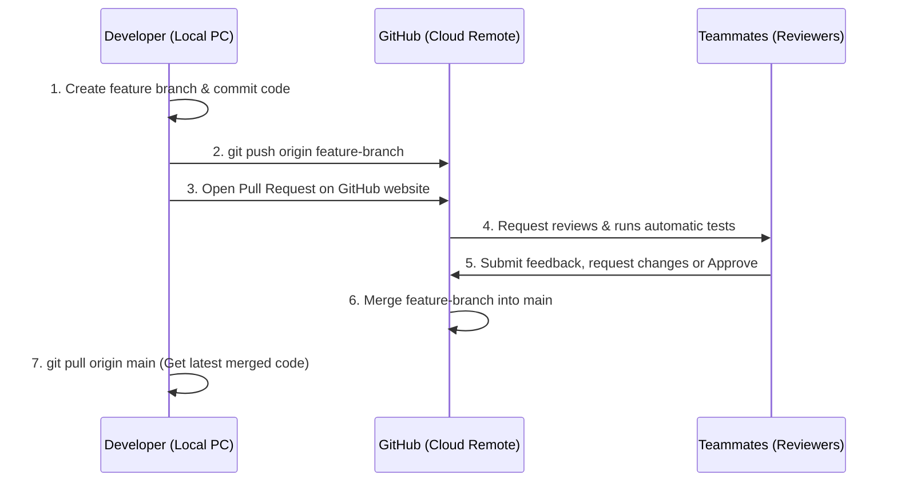
```mermaid
sequenceDiagram
    participant Dev as Developer (Local PC)
    participant GH as GitHub (Cloud Remote)
    participant Team as Teammates (Reviewers)
    
    Dev->>Dev: 1. Create feature branch & commit code
    Dev->>GH: 2. git push origin feature-branch
    Dev->>GH: 3. Open Pull Request on GitHub website
    GH->>Team: 4. Request reviews & runs automatic tests
    Team->>GH: 5. Submit feedback, request changes or Approve
    GH->>GH: 6. Merge feature-branch into main
    Dev->>Dev: 7. git pull origin main (Get latest merged code)
```

### Step-by-Step Collaborative Workflow

#### Step 1: Sync Your Local Repository
Before you write any new code, you must fetch and merge the latest work pushed by your team to GitHub. Failing to do this causes your local repository to fall out of sync, leading to merge conflicts.
```bash
git checkout main
git pull origin main
```
* **Explanation**: Switches to your local `main` branch, then downloads and merges changes from `origin` (GitHub's default remote shortcut name) into your local branch.

#### Step 2: Create a Feature Branch
Create a branch specifically for the feature or bug fix you are working on. Keep branches small and focused on one task (e.g., don't implement both motor PWM and visual camera processing on the same branch).
```bash
git checkout -b feature/motor-pwm
```

#### Step 3: Write Code and Commit Locally
Work on your code files in your editor. Save your progress using local commits.
```bash
# ...make edits to motor.cpp...
git status
git add motor.cpp
git commit -m "Implement safe PWM limit capping for motor control"
```

#### Step 4: Push to the Cloud
Upload your local feature branch to GitHub. This makes your code available on the remote server but does not affect the remote `main` branch.
```bash
git push origin feature/motor-pwm
```

#### Step 5: Create a Pull Request (PR)
1. Open GitHub in your browser.
2. Navigate to your repository. You will see a banner saying *"feature/motor-pwm had recent pushes"* with a button labeled **"Compare & pull request"**.
3. Click this button, write a descriptive summary of your changes, and click **"Create Pull Request"**.
4. Request reviews from your team members 

#### Step 6: Code Review & Merging
Your teammates review your code, leaving line-by-line comments if changes are needed. Once approved, the PR can be merged into `main` directly through the GitHub web interface.

---

## Phase 7: Real Workflow Example — Motor Control

This section walks through a complete, real-world example of the Git workflow. The scenario: you are adding motor PWM control to your team's shared robot repository.

### 📊 Flowchart: The Complete Real Workflow
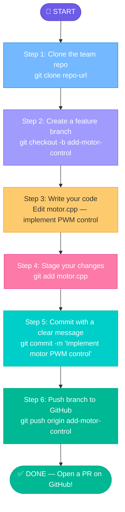
```mermaid
flowchart TD
    S1(["🚀 START"]) --> Clone["Step 1: Clone the team repo\ngit clone repo-url"]
    Clone --> Branch["Step 2: Create a feature branch\ngit checkout -b add-motor-control"]
    Branch --> Edit["Step 3: Write your code\nEdit motor.cpp — implement PWM control"]
    Edit --> Stage["Step 4: Stage your changes\ngit add motor.cpp"]
    Stage --> Commit["Step 5: Commit with a clear message\ngit commit -m 'Implement motor PWM control'"]
    Commit --> Push["Step 6: Push branch to GitHub\ngit push origin add-motor-control"]
    Push --> Done(["✅ DONE — Open a PR on GitHub!"])

    style S1 fill:#6c5ce7,stroke:#5f3dc4,color:#fff
    style Clone fill:#74b9ff,stroke:#0984e3,color:#fff
    style Branch fill:#a29bfe,stroke:#6c5ce7,color:#fff
    style Edit fill:#fdcb6e,stroke:#f39c12,color:#333
    style Stage fill:#fd79a8,stroke:#e84393,color:#fff
    style Commit fill:#00cec9,stroke:#00b894,color:#fff
    style Push fill:#00b894,stroke:#00a884,color:#fff
    style Done fill:#00b894,stroke:#00a884,color:#fff
```

### Step-by-Step Terminal Walkthrough

#### Step 1: Clone the Team Repository
Your team lead has already created a repository on GitHub called `team-robot-project`. You need to download it to your local machine so you can start contributing.
```bash
git clone https://github.com/vvce-robotics/team-robot-project.git
cd team-robot-project
```
* **What it does**: Downloads the full repository — including all branches, commit history, and files — into a new folder called `team-robot-project` on your machine. The `cd` command then moves your terminal's working directory into that folder.

#### Step 2: Create an Isolated Feature Branch
Never work directly on `main`. Create a branch named after the feature you are building.
```bash
git checkout -b add-motor-control
```
* **What it does**: Creates a new branch called `add-motor-control` and switches to it immediately. All your future commits will be recorded on this branch, leaving `main` completely untouched.

#### Step 3: Write Your Code
Open your editor (VS Code, Antigravity, etc.) and create or edit the `motor.cpp` file. For example:
```cpp
// motor.cpp — Basic PWM motor control for the robot
#include <Arduino.h>

const int MOTOR_PIN = 9;
const int MAX_PWM = 255;
const int SAFE_LIMIT = 200; // Cap at 78% duty cycle for safety

void setup() {
    pinMode(MOTOR_PIN, OUTPUT);
}

void loop() {
    for (int speed = 0; speed <= SAFE_LIMIT; speed += 5) {
        analogWrite(MOTOR_PIN, speed);
        delay(50);
    }
}
```

#### Step 4: Stage the Changed File
```bash
git add motor.cpp
```
* **What it does**: Moves `motor.cpp` from the Working Directory to the Staging Area, marking it as ready for the next commit. You can also run `git add .` to stage all changed files at once.

#### Step 5: Commit with a Clear, Descriptive Message
```bash
git commit -m "Implement motor PWM control with safety limit capping"
```
* **What it does**: Saves a permanent snapshot of your staged changes into the local `.git` history. The message describes *what* was done and *why* (safety limit).

#### Step 6: Push Your Branch to GitHub
```bash
git push origin add-motor-control
```
* **What it does**: Uploads your local `add-motor-control` branch (with all its commits) to the remote repository on GitHub. Your teammates can now see your branch and review your code.

> [!TIP]
> **The Golden Order**: Always follow this sequence — **Pull → Branch → Work → Stage → Commit → Push**. Never skip pulling first, or you risk working on stale code and creating merge conflicts.

---

## Phase 8: Advanced Git Operations

Once you master the basic commands, you will need tools to manipulate commit history, debug issues, and manage work in progress.

### 1. `git stash`: The Virtual Shelving Unit
Suppose you are in the middle of writing unfinished PID logic on `feature/pid-controller`. Suddenly, the robot's main branch has an emergency bug that needs fixing immediately. You cannot switch branches because you have uncommitted changes in your Working Directory, and you don't want to make a messy, broken commit just to save your place.

### 📊 Flowchart: The `git stash` Emergency Workflow
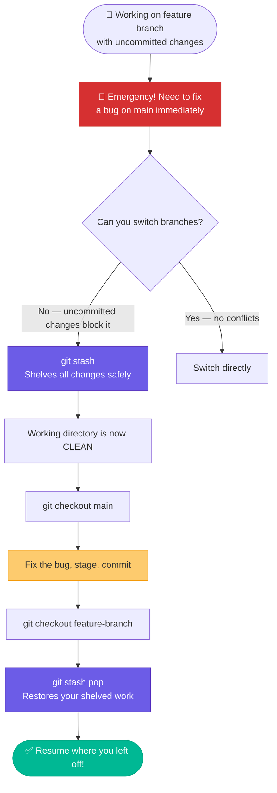
```mermaid
flowchart TD
    Working(["🔧 Working on feature branch\nwith uncommitted changes"]) --> Emergency["🚨 Emergency! Need to fix\na bug on main immediately"]
    Emergency --> Q{"Can you switch branches?"}
    Q -->|"No — uncommitted changes block it"| Stash["git stash\nShelves all changes safely"]
    Stash --> Clean["Working directory is now CLEAN"]
    Clean --> Switch["git checkout main"]
    Switch --> Fix["Fix the bug, stage, commit"]
    Fix --> Back["git checkout feature-branch"]
    Back --> Pop["git stash pop\nRestores your shelved work"]
    Pop --> Resume(["✅ Resume where you left off!"])

    Q -->|"Yes — no conflicts"| Direct["Switch directly"]

    style Emergency fill:#d63031,stroke:#c0392b,color:#fff
    style Stash fill:#6c5ce7,stroke:#5f3dc4,color:#fff
    style Pop fill:#6c5ce7,stroke:#5f3dc4,color:#fff
    style Resume fill:#00b894,stroke:#00a884,color:#fff
    style Fix fill:#fdcb6e,stroke:#f39c12,color:#333
```

* **What it does**: Temporarily saves (stashes) your modified files and clears your working directory so you can switch tasks.
* **Commands**:
  ```bash
  git stash               # Shelves your current work
  git checkout main       # Safely switch to main to fix the bug
  # ...fix bug and commit...
  git checkout feature/pid-controller
  git stash pop           # Restores your saved changes and resumes work
  ```
* **Useful Flags**:
  * `git stash list`: Shows a list of all your stashed changes.
  * `git stash clear`: Permanently deletes all stashed items.

### 2. `git rebase`: Writing a Clean, Linear History
By default, merging branches creates a "merge commit," which links the branch history back to `main`. This can lead to a messy, tangled history graph. Rebase works by lifting your feature branch commits and replaying them on top of the latest commit on `main`, keeping the commit log flat and linear.

* **Syntax**: `git rebase <target-branch>`
* **Visual Example**:
  ```text
  Before Rebase:
  main:     C1 --- C2
  feature:    \--- C3 --- C4
  
  After "git rebase main" run on feature branch:
  main:     C1 --- C2
  feature:           \--- C3' --- C4'
  ```
* **Usage**:
  ```bash
  git checkout feature/pid-controller
  git rebase main
  ```

> [!WARNING]
> Never rebase commits that have already been pushed to public remote repositories. Rebasing changes existing commit hashes, which will disrupt other developers working on the same branch.

### 3. `git cherry-pick`: Copying Individual Commits
If a developer wrote a brilliant bug fix in a commit (hash `a1c2e3f`) on a completely different branch, and you need that specific fix in your branch without merging their entire feature branch, you use cherry-pick.

* **Syntax**: `git cherry-pick <commit-hash>`
* **Example**:
  ```bash
  git cherry-pick a1c2e3f
  ```
* **What it does**: Copies the exact change from commit `a1c2e3f` and commits it onto your current branch as a new commit.

### 4. `git bisect`: Debugging via Binary Search
If a bug is discovered in the robot's locomotion module, but the team doesn't know which of the last 100 commits introduced it, `git bisect` automates finding it by performing a binary search.

### 📊 Flowchart: How `git bisect` Hunts Down Bugs
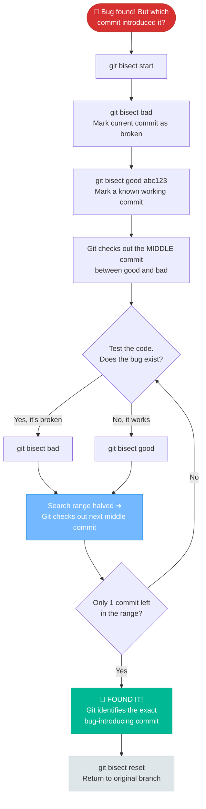
```mermaid
flowchart TD
    Start(["🐛 Bug found! But which\ncommit introduced it?"]) --> Begin["git bisect start"]
    Begin --> Bad["git bisect bad\nMark current commit as broken"]
    Bad --> Good["git bisect good abc123\nMark a known working commit"]
    Good --> Checkout["Git checks out the MIDDLE commit\nbetween good and bad"]
    Checkout --> Test{"Test the code.\nDoes the bug exist?"}
    Test -->|"Yes, it's broken"| MarkBad["git bisect bad"]
    Test -->|"No, it works"| MarkGood["git bisect good"]
    MarkBad --> Narrow["Search range halved ➜\nGit checks out next middle commit"]
    MarkGood --> Narrow
    Narrow --> Remaining{"Only 1 commit left\nin the range?"}
    Remaining -->|No| Test
    Remaining -->|Yes| Found["🎯 FOUND IT!\nGit identifies the exact\nbug-introducing commit"]
    Found --> Reset["git bisect reset\nReturn to original branch"]

    style Start fill:#d63031,stroke:#c0392b,color:#fff
    style Found fill:#00b894,stroke:#00a884,color:#fff
    style Reset fill:#dfe6e9,stroke:#b2bec3,color:#333
    style Narrow fill:#74b9ff,stroke:#0984e3,color:#fff
```

* **Process**:
  ```bash
  git bisect start
  git bisect bad                 # Mark current version as bad (bug is present)
  git bisect good c7a8b9d        # Mark c7a8b9d (e.g., 2 weeks ago) as a known good version
  ```
  Git will automatically checkout a commit in the middle of that history range. You test the robot.
  * If it works: type `git bisect good`.
  * If it is broken: type `git bisect bad`.
  Git repeats this binary division until it points to the exact commit that broke the code. Run `git bisect reset` when done to return to your original branch.

### 5. `git log --graph`: Visualizing History
* **Command**:
  ```bash
  git log --graph --oneline --all --decorate
  ```
* **What it does**: Draws a clean ASCII text diagram representing your branches, merge nodes, and commit history directly inside the terminal. The `--decorate` flag adds branch and tag labels to the graph.
* **Sample Output**:
  ```text
  * a3f7c2d (HEAD -> feature/motor-pwm) Implement motor PWM control
  * e1b9a4c Add motor pin configuration
  | * d5c8f1a (feature/pid-tuning) Tune PID constants for stability
  |/
  * 7b2e9d3 (origin/main, main) Initial project setup
  * 1c4a6f8 Add README.md with project description
  ```

### 6. `git remote`: Managing Remote Connections
* **Commands**:
  ```bash
  git remote -v                              # List all remotes with their URLs
  git remote add origin <URL>                # Link local repo to a GitHub URL
  git remote remove origin                   # Remove a remote connection
  git remote set-url origin <new-URL>        # Change the remote URL
  ```
* **What it does**: Manages the named shortcuts ("remotes") that point to remote repositories. By convention, `origin` is the default name for the primary remote. You can add multiple remotes if you contribute to both the original project and your fork.

### 7. `git diff`: Inspecting Changes Before Staging
* **Commands**:
  ```bash
  git diff                                   # Show unstaged changes (Working Directory vs. Staging Area)
  git diff --staged                          # Show staged changes (Staging Area vs. Last Commit)
  git diff main..feature/motor-pwm           # Compare two branches side by side
  ```
* **What it does**: Displays line-by-line differences between two states of your code. Lines prefixed with `+` are additions, lines prefixed with `-` are deletions. This is extremely useful for reviewing your own work before committing.

### 8. `git tag`: Marking Important Milestones
* **Commands**:
  ```bash
  git tag v1.0                               # Create a lightweight tag at current commit
  git tag -a v1.0 -m "First stable release"  # Create an annotated tag with a message
  git push origin v1.0                       # Push a specific tag to GitHub
  git push origin --tags                     # Push all tags to GitHub
  git tag -l                                 # List all tags
  ```
* **What it does**: Tags are permanent bookmarks on specific commits, typically used to mark release versions (e.g., `v1.0`, `v2.3-beta`). Unlike branches, tags do not move when new commits are added.

---

## Phase 9: .gitignore & GitHub Actions (CI/CD)

### The `.gitignore` File: Keeping Your Repo Clean

Not every file in your project should be tracked by Git. Compiled binaries, temporary OS files, IDE configuration folders, API keys, and dependency directories (like `node_modules/`) should be excluded from version control. The `.gitignore` file tells Git which files and folders to permanently ignore.

#### Creating a `.gitignore` File
Create a file named `.gitignore` in the root of your repository (same level as your `.git` folder):
```bash
touch .gitignore
```

#### Example `.gitignore` for a Robotics/Arduino Project
```gitignore
# Compiled binaries and object files
*.o
*.elf
*.hex
*.bin
build/

# IDE and editor files
.vscode/
.idea/
*.swp
*.swo
*~
.DS_Store
Thumbs.db

# Dependency directories
node_modules/
__pycache__/
*.pyc

# Environment and secret files
.env
.env.local
secrets.yaml

# Log files
*.log
logs/
```

#### How `.gitignore` Pattern Matching Works
| Pattern | What It Ignores |
|:---|:---|
| `*.log` | All files ending in `.log` in any directory |
| `build/` | The entire `build` directory and everything inside it |
| `!important.log` | Exception — do NOT ignore `important.log` even if `*.log` is listed |
| `docs/*.pdf` | PDF files only in the `docs/` directory (not subdirectories) |
| `**/temp` | Any file or folder named `temp` at any depth |
| `.env` | The specific file named `.env` in the root directory |

> [!IMPORTANT]
> The `.gitignore` file only prevents **untracked** files from being staged. If a file was already committed before you added it to `.gitignore`, you must explicitly untrack it:
> ```bash
> git rm --cached filename.log
> git commit -m "Remove tracked log file and add to .gitignore"
> ```

### 📊 Flowchart: Should This File Be in `.gitignore`?
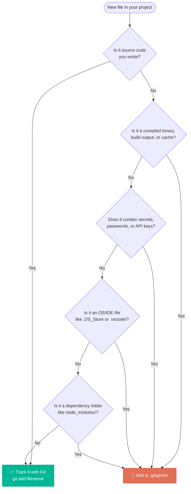
```mermaid
flowchart TD
    Start(["New file in your project"]) --> Q1{"Is it source code\nyou wrote?"}
    Q1 -->|Yes| Track["✅ Track it with Git\ngit add filename"]
    Q1 -->|No| Q2{"Is it a compiled binary,\nbuild output, or cache?"}
    Q2 -->|Yes| Ignore["🚫 Add to .gitignore"]
    Q2 -->|No| Q3{"Does it contain secrets,\npasswords, or API keys?"}
    Q3 -->|Yes| Ignore
    Q3 -->|No| Q4{"Is it an OS/IDE file\nlike .DS_Store or .vscode/?"}
    Q4 -->|Yes| Ignore
    Q4 -->|No| Q5{"Is it a dependency folder\nlike node_modules/?"}
    Q5 -->|Yes| Ignore
    Q5 -->|No| Track

    style Track fill:#00b894,stroke:#00a884,color:#fff
    style Ignore fill:#e17055,stroke:#d63031,color:#fff
```

---

### GitHub Actions: Automating Your Workflow with CI/CD

GitHub Actions is a powerful automation platform built directly into GitHub. It allows you to define workflows that automatically run tasks — such as testing your code, building your project, or deploying to a server — every time you push code, open a pull request, or trigger other events.

#### What is CI/CD?
* **CI (Continuous Integration)**: Automatically running tests and builds whenever new code is pushed. This catches bugs early, before they reach `main`.
* **CD (Continuous Deployment/Delivery)**: Automatically deploying tested code to production or staging environments.

#### How It Works
GitHub Actions workflows are defined in YAML files stored inside the `.github/workflows/` directory of your repository. Each YAML file defines:
1. **Trigger events** (e.g., `on: push`, `on: pull_request`)
2. **Jobs** to run (e.g., test, build, deploy)
3. **Steps** within each job (e.g., install dependencies, run tests)

#### Example: Auto-Run Tests on Every Push
```yaml
# .github/workflows/test.yml
name: Run Tests

on:
  push:
    branches: [main]
  pull_request:
    branches: [main]

jobs:
  test:
    runs-on: ubuntu-latest
    steps:
      - name: Checkout code
        uses: actions/checkout@v4

      - name: Set up Python
        uses: actions/setup-python@v5
        with:
          python-version: '3.11'

      - name: Install dependencies
        run: pip install -r requirements.txt

      - name: Run tests
        run: python -m pytest tests/ -v
```

#### Example: Auto-Build Arduino Sketch on Every PR
```yaml
# .github/workflows/arduino-build.yml
name: Build Arduino Sketch

on:
  pull_request:
    branches: [main]

jobs:
  build:
    runs-on: ubuntu-latest
    steps:
      - name: Checkout code
        uses: actions/checkout@v4

      - name: Compile Arduino Sketch
        uses: arduino/compile-sketches@v1
        with:
          fqbn: 'arduino:avr:uno'
          sketch-paths: './src'
```

### 📊 Flowchart: How GitHub Actions Automates Your Workflow
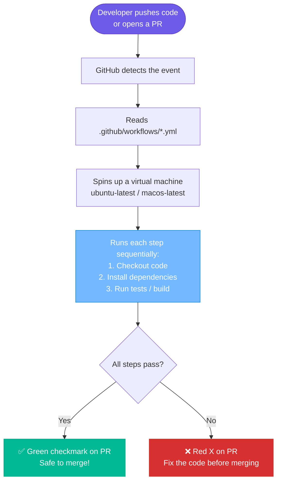
```mermaid
flowchart TD
    Push(["Developer pushes code\nor opens a PR"]) --> Trigger["GitHub detects the event"]
    Trigger --> Read["Reads .github/workflows/*.yml"]
    Read --> Spin["Spins up a virtual machine\nubuntu-latest / macos-latest"]
    Spin --> Steps["Runs each step sequentially:\n1. Checkout code\n2. Install dependencies\n3. Run tests / build"]
    Steps --> Result{"All steps pass?"}
    Result -->|Yes| Green["✅ Green checkmark on PR\nSafe to merge!"]
    Result -->|No| Red["❌ Red X on PR\nFix the code before merging"]

    style Push fill:#6c5ce7,stroke:#5f3dc4,color:#fff
    style Green fill:#00b894,stroke:#00a884,color:#fff
    style Red fill:#d63031,stroke:#c0392b,color:#fff
    style Steps fill:#74b9ff,stroke:#0984e3,color:#fff
```

> [!TIP]
> **Gitopia** — an interactive visual learning tool for Git — is a great companion to this guide. You can explore it at **[gitopia.vercel.app](https://gitopia.vercel.app)** to practice branching, merging, and rebasing in a visual sandbox before running real commands.

---

## Phase 10: Troubleshooting Common Mistakes & Resolving Merge Conflicts

### Common Beginner Mistakes
* **Forgetting to Pull**: Working on an outdated local branch leads to conflicts when pushing. **Fix**: Run `git pull origin main` before writing code.
* **Vague Commit Messages**: Committing with a message like `"fix"` or `"temp"` makes code history useless. **Fix**: Use descriptive summaries, like `"Fix motor PWM overflow on acceleration path"`.
* **Committing Directly to Main**: Pushing experimental or broken code directly to `main`. **Fix**: Always create a feature branch (`git checkout -b <name>`).

### 📊 Flowchart: "I Made a Mistake!" — Git Recovery Guide
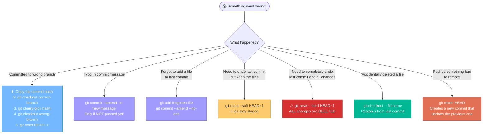
```mermaid
flowchart TD
    Start(["😱 Something went wrong!"]) --> Q1{"What happened?"}

    Q1 -->|"Committed to wrong branch"| WrongBranch["1. Copy the commit hash\n2. git checkout correct-branch\n3. git cherry-pick hash\n4. git checkout wrong-branch\n5. git reset HEAD~1"]

    Q1 -->|"Typo in commit message"| FixMsg["git commit --amend -m 'new message'\nOnly if NOT pushed yet!"]

    Q1 -->|"Forgot to add a file\nto last commit"| AddFile["git add forgotten-file\ngit commit --amend --no-edit"]

    Q1 -->|"Need to undo last commit\nbut keep the files"| SoftReset["git reset --soft HEAD~1\nFiles stay staged"]

    Q1 -->|"Need to completely undo\nlast commit and all changes"| HardReset["⚠️ git reset --hard HEAD~1\nALL changes are DELETED"]

    Q1 -->|"Accidentally deleted a file"| Restore["git checkout -- filename\nRestores from last commit"]

    Q1 -->|"Pushed something bad\nto remote"| Revert["git revert HEAD\nCreates a new commit that\nundoes the previous one"]

    style WrongBranch fill:#74b9ff,stroke:#0984e3,color:#fff
    style FixMsg fill:#a29bfe,stroke:#6c5ce7,color:#fff
    style AddFile fill:#a29bfe,stroke:#6c5ce7,color:#fff
    style SoftReset fill:#fdcb6e,stroke:#f39c12,color:#333
    style HardReset fill:#d63031,stroke:#c0392b,color:#fff
    style Restore fill:#00b894,stroke:#00a884,color:#fff
    style Revert fill:#e17055,stroke:#d63031,color:#fff
```

---

### Resolving Merge Conflicts
A merge conflict occurs when two different branches modify the exact same line of the same file, or if one developer deletes a file that another developer is modifying. Git is a safety-first tool; it refuses to make assumptions about which developer's work is correct, and pauses the merge to request human intervention.

### 📊 Flowchart: Step-by-Step Merge Conflict Resolution
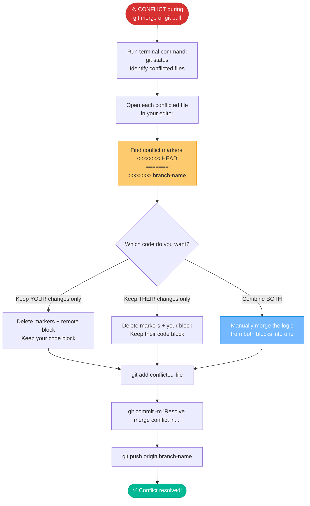
```mermaid
flowchart TD
    Start(["⚠️ CONFLICT during\ngit merge or git pull"]) --> Status["Run terminal command:\ngit status\nIdentify conflicted files"]
    Status --> Open["Open each conflicted file\nin your editor"]
    Open --> Find["Find conflict markers:\n<<<<<<< HEAD\n=======\n>>>>>>> branch-name"]
    Find --> Decide{"Which code do you want?"}
    Decide -->|"Keep YOUR changes only"| Yours["Delete markers + remote block\nKeep your code block"]
    Decide -->|"Keep THEIR changes only"| Theirs["Delete markers + your block\nKeep their code block"]
    Decide -->|"Combine BOTH"| Both["Manually merge the logic\nfrom both blocks into one"]
    Yours --> Stage["git add conflicted-file"]
    Theirs --> Stage
    Both --> Stage
    Stage --> Commit["git commit -m 'Resolve merge conflict in...'"]
    Commit --> Push["git push origin branch-name"]
    Push --> Done(["✅ Conflict resolved!"])

    style Start fill:#d63031,stroke:#c0392b,color:#fff
    style Find fill:#fdcb6e,stroke:#f39c12,color:#333
    style Done fill:#00b894,stroke:#00a884,color:#fff
    style Both fill:#74b9ff,stroke:#0984e3,color:#fff
```

```text
Conflict Markers Generated by Git in code files:

<<<<<<< HEAD
// BHARATH's local changes on his branch
pwm_frequency = 25000;
=======
// SURESH's remote changes pushed to main
pwm_frequency = 32000;
>>>>>>> main
```

#### Step-by-Step Resolution Guide
1. **Identify the Conflicted Files**: Running `git status` will list files under the heading *"Both Modified"*.
2. **Open the Files in Your Editor**: Look for the conflict markers (`<<<<<<<`, `=======`, and `>>>>>>>`).
3. **Decide Which Code to Keep**:
   * To keep only your local changes, delete the marker lines and the remote code block.
   * To keep only the remote changes, delete the marker lines and your local code block.
   * To merge them, edit the code inside the markers manually to integrate both changes safely.
4. **Clean up and Stage**: Delete all conflict marker lines entirely, leaving only valid source code.
5. **Finalize the Merge**:
   ```bash
   git add motor.cpp
   git commit -m "Resolve merge conflict in motor PWM configuration"
   git push origin feature/your-branch
   ```

---

## Phase 11: Hands-On Activity — Build Your First Repository

This guided activity will help you put everything from this guide into practice. Complete these 5 tasks to build a real team robot repository from scratch. Each task builds on the previous one.

### 📊 Flowchart: The 5-Task Activity Path
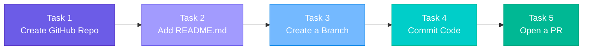
```mermaid
flowchart LR
    T1["Task 1\nCreate GitHub Repo"] --> T2["Task 2\nAdd README.md"]
    T2 --> T3["Task 3\nCreate a Branch"]
    T3 --> T4["Task 4\nCommit Code"]
    T4 --> T5["Task 5\nOpen a PR"]

    style T1 fill:#6c5ce7,stroke:#5f3dc4,color:#fff
    style T2 fill:#a29bfe,stroke:#6c5ce7,color:#fff
    style T3 fill:#74b9ff,stroke:#0984e3,color:#fff
    style T4 fill:#00cec9,stroke:#00b894,color:#fff
    style T5 fill:#00b894,stroke:#00a884,color:#fff
```

---

### ✅ Task 1: Create a GitHub Repository
1. Go to [github.com](https://github.com) and sign in.
2. Click the **"+"** icon in the top-right corner → **"New repository"**.
3. Name it `team-robot-project`.
4. Set visibility to **Public** (so teammates can access it).
5. Check **"Add a README file"** to auto-generate a basic `README.md`.
6. Click **"Create repository"**.

Now clone it to your local machine:
```bash
git clone https://github.com/YOUR-USERNAME/team-robot-project.git
cd team-robot-project
```

---

### ✅ Task 2: Add a README.md
Open the `README.md` file and replace its contents with a proper project description:
```markdown
# 🤖 Team Robot Project

## About
This repository contains the control software for the humanoid robot.
Built by the robotics team at VVCE.

## Team Members
- RAJU
- SURESH
- RAMESH


## Tech Stack
- Arduino (C++)
- Python (data processing)
- ROS2 (robot operating system)

## Getting Started
1. Clone this repo: `git clone <repo-url>`
2. Open in VS Code or Arduino IDE
3. Upload to Arduino Uno via USB
```

Stage and commit:
```bash
git add README.md
git commit -m "Add detailed project description and team members to README"
git push origin main
```

---

### ✅ Task 3: Create a Feature Branch
Create a branch specifically for adding motor control code:
```bash
git checkout -b add-motor-code
```
* Verify you are on the new branch:
```bash
git branch
```
* Expected output:
```text
  main
* add-motor-code
```

---

### ✅ Task 4: Commit a Simple `motor.cpp` File
Create a new file called `motor.cpp`:
```cpp
// motor.cpp — Basic motor control for the robot
#include <Arduino.h>

const int MOTOR_PIN = 9;

void setup() {
    pinMode(MOTOR_PIN, OUTPUT);
    Serial.begin(9600);
    Serial.println("Motor initialized.");
}

void loop() {
    analogWrite(MOTOR_PIN, 150); // 59% duty cycle
    delay(2000);
    analogWrite(MOTOR_PIN, 0);   // Stop
    delay(1000);
}
```

Stage and commit:
```bash
git add motor.cpp
git commit -m "Add basic motor control with PWM output"
```

Push the branch to GitHub:
```bash
git push origin add-motor-code
```

---

### ✅ Task 5: Open Your First Pull Request
1. Go to your repository on **GitHub.com**.
2. You should see a yellow banner: *"add-motor-code had recent pushes — Compare & pull request"*.
3. Click **"Compare & pull request"**.
4. Write a title: `Add basic motor control module`
5. Write a description:
   ```
   This PR adds the initial motor.cpp file with:
   - PWM output on pin 9
   - 59% duty cycle with 2-second on/1-second off pattern
   - Serial logging for debugging
   
 
   ```
6. Click **"Create pull request"**.
7. Ask a teammate to review and approve it.
8. Once approved, click **"Merge pull request"** → **"Confirm merge"**.
9. Optionally, delete the branch after merging.

> [!NOTE]
> After merging, remember to switch back to `main` and pull the latest changes:
> ```bash
> git checkout main
> git pull origin main
> ```

---

## Phase 12: Unleashing Git with Antigravity Agent & Terminal

When writing code in this workspace, you are paired with **Antigravity**, an agentic AI assistant designed by Google DeepMind. Antigravity does not just explain concepts—it can execute workflows for you inside its integrated terminal.

### 📊 Flowchart: When to Use Antigravity vs. Manual Terminal
```mermaid
flowchart TD
    Start(["You need to perform\na Git operation"]) --> Q1{"Is it a simple,\nsingle command?"}
    Q1 -->|"Yes — e.g., git status"| Manual["Type it yourself in terminal\nor ask Antigravity"]
    Q1 -->|"No — complex workflow"| Q2{"What kind of workflow?"}

    Q2 -->|"Multi-step branching +\ncommit + push"| Delegate1["💬 Ask Antigravity:\n'Create branch feature/x,\nadd files, commit, and push'"]
    Q2 -->|"Merge conflict\nresolution"| Delegate2["💬 Ask Antigravity:\n'Resolve the merge conflict\nin file.cpp intelligently'"]
    Q2 -->|"Analyze git history\nor find a bug"| Delegate3["💬 Ask Antigravity:\n'Find which commit broke\nthe motor test'"]
    Q2 -->|"Long-running migration\nor refactor"| Slash["Use /goal command\nfor continuous autonomous work"]
    Q2 -->|"Recurring scheduled\noperations"| Schedule["Use /schedule command\ne.g., daily git pull + build check"]

    Manual --> Approve(["✅ Command runs directly"])
    Delegate1 --> Review["Antigravity proposes commands"]
    Delegate2 --> Review
    Delegate3 --> Review
    Review --> Approve2{"You review & approve?"}
    Approve2 -->|Yes| Execute(["✅ Antigravity executes"])
    Approve2 -->|No| Modify["Modify the approach"]
    Modify --> Review

    style Delegate1 fill:#6c5ce7,stroke:#5f3dc4,color:#fff
    style Delegate2 fill:#6c5ce7,stroke:#5f3dc4,color:#fff
    style Delegate3 fill:#6c5ce7,stroke:#5f3dc4,color:#fff
    style Slash fill:#e17055,stroke:#d63031,color:#fff
    style Schedule fill:#fdcb6e,stroke:#f39c12,color:#333
    style Execute fill:#00b894,stroke:#00a884,color:#fff
    style Approve fill:#00b894,stroke:#00a884,color:#fff
```

### The Antigravity Sandbox Terminal
Antigravity operates a terminal on your macOS system. It executes commands securely on your behalf after you approve them. Because the terminal operates with `PAGER=cat`, long terminal listings (like standard `git log` commands) will not freeze; they are printed cleanly into your chat window.

### Delegating Version Control to Antigravity

Instead of typing commands manually, you can ask Antigravity to perform Git operations for you. Here are examples of prompts you can use to interact with Antigravity:

* **To Initialise and Setup**:
  > *"Antigravity, configure my Git global identity with username 'BHARATH' and email 'BHARATH@example.com'. Then initialize a Git repo in this folder."*
* **To Handle Branch Management**:
  > *"Antigravity, checkout a new branch named 'feature/imu-filter', write a basic sensor read script in Python, and commit it."*
* **To Stage and Auto-Write Commit Messages**:
  > *"Antigravity, write a descriptive commit message based on the edits I just made to the motor file and commit them."*
  * *How it works*: Antigravity will scan your code diffs, synthesize what changed (e.g., logic modifications in motor loops), write a professional commit message, and stage/commit it cleanly.
* **To Resolve Merge Conflicts**:
  > *"Antigravity, we have a merge conflict in motor.cpp. Review both versions of the motor speed controls, merge them logically so both safeguards are kept, and commit the resolution."*
  * *How it works*: Antigravity reads the file contents, understands the logical intent of both branches, resolves the markers, stages the file, and runs the final commit command.

### Recommended Slash Commands
As you collaborate using the chat UI, you can use these shortcuts:
* `/goal`: Trigger this when you have a massive Git migration or a long-running code refactoring task, and you want Antigravity to work continuously through branches, staging, and commits without pausing.
* `/schedule`: Use this to run automated tasks, such as scheduling Antigravity to run a `git pull origin main` and run project build checks every morning to make sure your local environment is healthy.

---

## Phase 13: Learning Outcomes, Tools Used & Next Steps

### ✅ Learning Outcomes
After completing this guide, you should be confident in the following:

| # | Outcome | Status |
|:--|:--------|:------:|
| 1 | Understand why version control is essential for teams | ☐ |
| 2 | Explain the difference between Git (local software) and GitHub (cloud platform) | ☐ |
| 3 | Understand repositories, commits, branches, and pull requests | ☐ |
| 4 | Use core Git commands: `clone`, `add`, `commit`, `push`, `pull` | ☐ |
| 5 | Follow the pull request workflow for code review | ☐ |
| 6 | Resolve merge conflicts with confidence | ☐ |
| 7 | Apply GitHub best practices for robotics teams | ☐ |
| 8 | Create and manage a team robot repository | ☐ |
| 9 | Write clear commit messages and README files | ☐ |
| 10 | Know your next steps for continued learning | ☐ |

---

### 🛠️ Tools Used in This Guide

| Tool | Purpose | Link |
|:-----|:--------|:-----|
| **Git** | Local version control engine | [git-scm.com](https://git-scm.com) |
| **GitHub** | Cloud hosting, collaboration, and code review | [github.com](https://github.com) |
| **VS Code** | Code editor with built-in Git integration | [code.visualstudio.com](https://code.visualstudio.com) |
| **Terminal / Zsh** | Command-line interface for running Git commands | Built into macOS |
| **Branches** | Parallel development environments within Git | N/A (Git feature) |
| **Pull Requests** | GitHub's code review and merge proposal system | N/A (GitHub feature) |
| **README.md** | Project documentation written in Markdown | N/A (Convention) |
| **.gitignore** | File to exclude unwanted files from version control | N/A (Git feature) |
| **GitHub Actions** | CI/CD automation for testing and deployment | [docs.github.com/actions](https://docs.github.com/en/actions) |
| **Antigravity** | AI coding assistant with integrated terminal | Built into your IDE |
| **Gitopia** | Visual interactive Git learning sandbox | [gitopia.vercel.app](https://gitopia.vercel.app) |

---

### 🚀 Next Steps & Learning Resources

Your journey with Git doesn't end here. These are the best resources for continued learning, practice, and mastery:

#### 🎮 Interactive Practice (Learn by Doing)
| Resource | Description | Link |
|:---------|:------------|:-----|
| **Learn Git Branching** | The #1 interactive visual tutorial. Practice branching, merging, rebasing, and cherry-picking in a sandbox. Highly recommended as your immediate next step. | [learngitbranching.js.org](https://learngitbranching.js.org) |
| **GitHub Skills** | Official GitHub-guided courses. Complete hands-on exercises directly inside real repositories on GitHub. | [skills.github.com](https://skills.github.com) |
| **Gitopia** | Visual interactive Git learning sandbox. Great for experimenting with branches and merges visually. | [gitopia.vercel.app](https://gitopia.vercel.app) |

#### 📚 Reference & Deep Learning
| Resource | Description | Link |
|:---------|:------------|:-----|
| **Pro Git Book** | The definitive, free, open-source Git textbook. Covers everything from basics to Git internals. | [git-scm.com/book](https://git-scm.com/book/en/v2) |
| **Oh Shit, Git!?!** | A humor-filled, practical guide to fixing common Git mistakes. Bookmark this for emergencies. | [ohshitgit.com](https://ohshitgit.com) |
| **Git Documentation** | Official man pages and reference for every Git command. | [git-scm.com/docs](https://git-scm.com/docs) |
| **GitHub Docs** | Official documentation for all GitHub features including Actions, Pages, and API. | [docs.github.com](https://docs.github.com) |

#### 🧠 Recommended Learning Path
```mermaid
flowchart LR
    A["1. Complete this guide"] --> B["2. Learn Git Branching\nlearngitbranching.js.org"]
    B --> C["3. GitHub Skills courses\nskills.github.com"]
    C --> D["4. Read Pro Git Book\nChapters 1-3"]
    D --> E["5. Contribute to\nopen-source projects"]
    E --> F["6. Set up GitHub Actions\nin your own repos"]

    style A fill:#6c5ce7,stroke:#5f3dc4,color:#fff
    style B fill:#a29bfe,stroke:#6c5ce7,color:#fff
    style C fill:#74b9ff,stroke:#0984e3,color:#fff
    style D fill:#00cec9,stroke:#00b894,color:#fff
    style E fill:#00b894,stroke:#00a884,color:#fff
    style F fill:#fdcb6e,stroke:#f39c12,color:#333
```

> [!TIP]
> **Best Practice**: After finishing this guide, immediately go to [learngitbranching.js.org](https://learngitbranching.js.org) and complete the "Main" sequence. It takes about 30 minutes, and it will solidify everything you've learned today through interactive visualization.

---

### 📋 Quick Reference: All Git Commands Cheat Sheet

| Command | What It Does |
|:--------|:-------------|
| `git init` | Initialize a new local repository |
| `git clone <URL>` | Download a remote repository to your machine |
| `git status` | Show modified, staged, and untracked files |
| `git add <file>` | Stage a specific file for the next commit |
| `git add .` | Stage all changed files |
| `git commit -m "msg"` | Save a snapshot with a descriptive message |
| `git push origin <branch>` | Upload local commits to GitHub |
| `git pull origin <branch>` | Download and merge remote changes |
| `git branch` | List all local branches |
| `git branch -a` | List all local and remote branches |
| `git branch <name>` | Create a new branch |
| `git branch -d <name>` | Delete a branch |
| `git checkout <branch>` | Switch to an existing branch |
| `git checkout -b <name>` | Create and switch to a new branch |
| `git switch <branch>` | Modern alternative to checkout for switching |
| `git merge <branch>` | Merge another branch into your current branch |
| `git log --graph --oneline --all` | Visualize commit history as a graph |
| `git diff` | Show unstaged changes |
| `git diff --staged` | Show staged changes |
| `git stash` | Temporarily shelve uncommitted changes |
| `git stash pop` | Restore the most recently stashed changes |
| `git stash list` | List all stashed entries |
| `git rebase <branch>` | Replay commits on top of another branch |
| `git cherry-pick <hash>` | Copy a specific commit to your current branch |
| `git bisect start` | Begin binary search for a bug-introducing commit |
| `git remote -v` | List remote connections and their URLs |
| `git remote add origin <URL>` | Link local repo to a remote URL |
| `git tag <name>` | Create a tag at the current commit |
| `git tag -a <name> -m "msg"` | Create an annotated tag with a message |
| `git rm --cached <file>` | Untrack a file without deleting it |
| `git reset --soft HEAD~1` | Undo last commit, keep files staged |
| `git reset --hard HEAD~1` | Undo last commit and delete all changes |
| `git revert HEAD` | Create a new commit that undoes the last commit |
| `git commit --amend -m "msg"` | Edit the message of the last commit |
| `git config --global user.name` | Set your global Git username |
| `git config --global user.email` | Set your global Git email |
| `git config --list` | Show all current Git configurations |

---

*This guide was created as part of the **GitHub Fundamentals Guide Series**, powered by **Antigravity** — your agentic AI coding assistant by Google DeepMind.*

*You can now collaborate with confidence.* 🚀

---

### 👤 Author Details
* **Name**: BHARATH Kumar A
* **GitHub**: [@BHARATHkumar000](https://github.com/BHARATHkumar000)
* **Email**: BHARATHece2006@gmail.com
