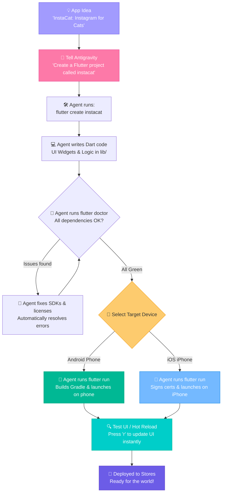
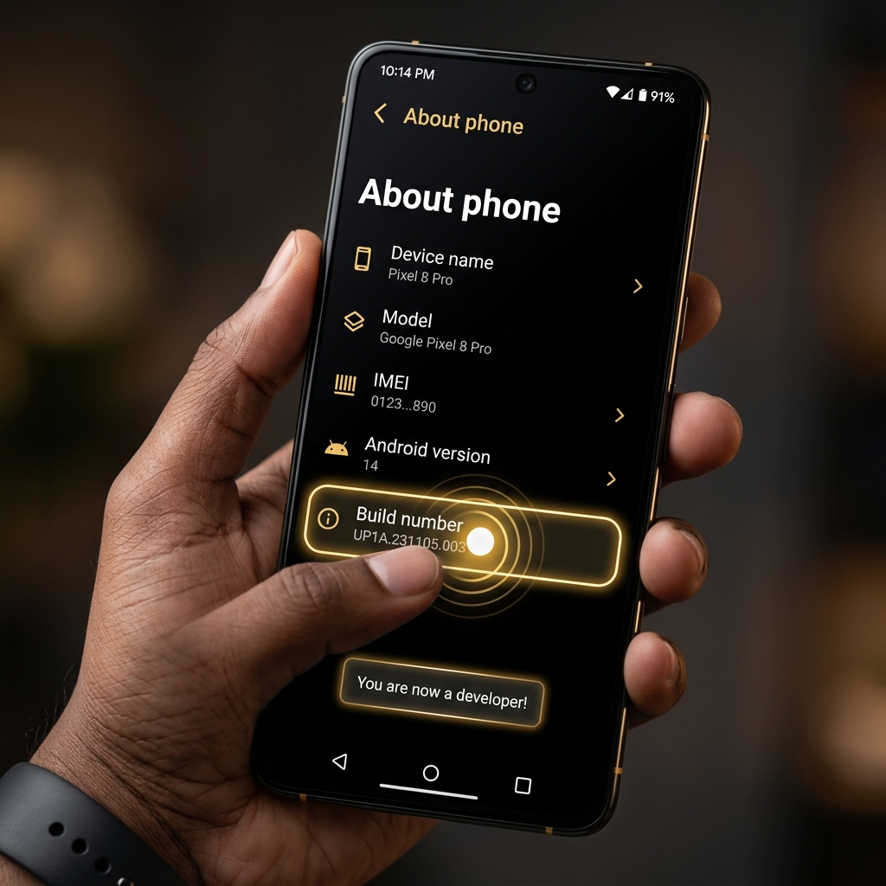
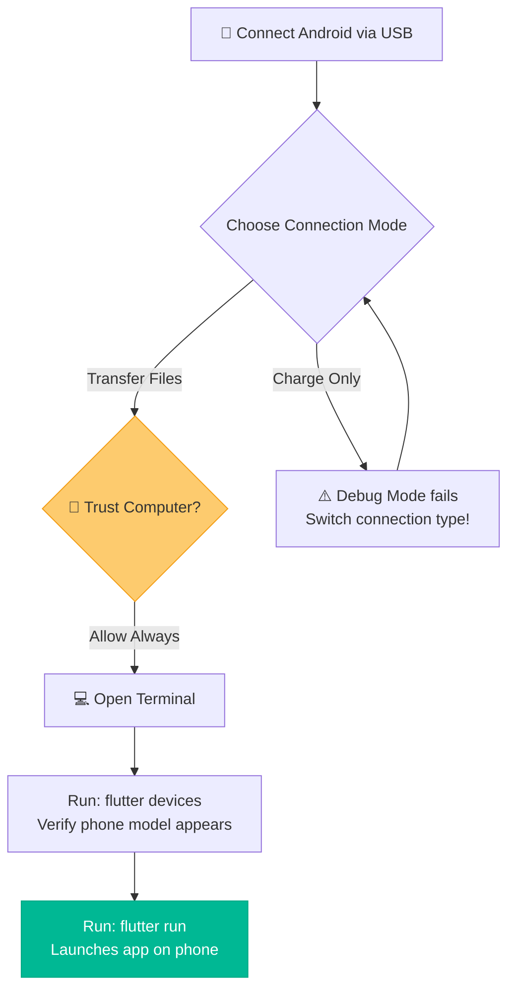
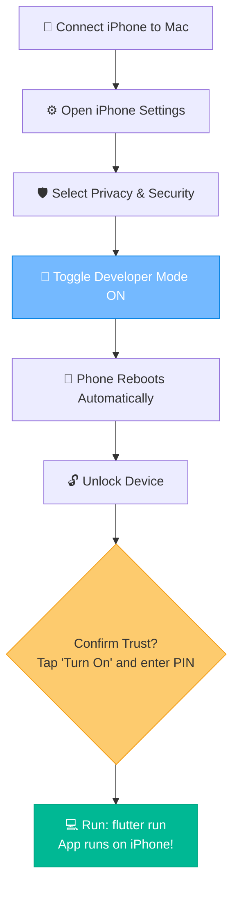

# 📱 Building Mobile Apps with Antigravity, Flutter & Dart

Trying to build a mobile app from scratch can feel like trying to train a cat to do synchronized swimming while juggling burning torches. One minute Apple rejects your app because a button color is "too blue," the next minute Android complains that your Gradle build has transcended into another dimension, and your test phone acts as if you just plugged in a high-tech potato.

The good news? You don't have to suffer alone. This guide is your survival manual to master **Flutter and Dart** using **[Antigravity](antigravity.md)** as your agentic coding co-pilot. Instead of manually running every terminal command, debugging Gradle errors, or wrestling with Xcode signing certificates yourself, you will delegate the heavy lifting to Antigravity — while you focus on designing beautiful screens and approving execution plans.

### 🧭 The 5W 1H of Mobile App Development with Antigravity
*   **Who is this for?** Aspiring mobile developers who want to write a single codebase that runs on both Android and iPhone, powered by an AI agent that handles the tedious setup.
*   **What is it?** A step-by-step masterclass covering Flutter installation, developer mode unlocking, SDK compilation, and building cross-platform apps — all orchestrated through Antigravity.
*   **Where does it run?** Antigravity runs commands in your local terminal, compiles the code, and deploys it to physical test phones, simulators, and eventually the App Stores.
*   **When should you use it?** The moment you want to turn a web vibe or dynamic prototype into an interactive, touch-screen pocket experience.
*   **Why use Flutter + Antigravity?** Because coding native apps twice is double the therapy bills, and manually debugging SDK paths is a waste of your coffee time. Let the agent handle it.
*   **How does it work?** You describe what you want in natural language, Antigravity writes Dart widgets, configures platform SDKs, runs `flutter doctor`, and launches the app on your connected device — all with your approval.

---

## 🗺️ The Antigravity Mobile Development Loop

Here is the journey your code takes — from idea to device screen — with Antigravity driving the execution:



---

## 🚀 Step 1: Getting Your Dev Kit Ready (with Antigravity)

Before we deploy to real phones, we need the Flutter engine installed on our computer. You can do most of these steps by simply asking **[Antigravity](antigravity.md)** to run them for you!

### The Essential Installation Commands
1. **Download & Extract**: Download the Flutter SDK zip/bundle for macOS/Windows from [flutter.dev](https://flutter.dev) and extract it to a development folder (e.g., `~/developer/flutter`).
2. **Add to Path**: Update your terminal path configurations (`~/.zshrc` or `~/.bash_profile`) so your computer knows where `flutter` is:
   ```bash
   export PATH="$PATH:$HOME/developer/flutter/bin"
   ```
3. **Run Diagnostics via Antigravity**: Instead of running this manually, ask Antigravity:
   > *"Antigravity, run `flutter doctor` in the terminal and tell me if there are any missing components or license errors."*
   
   Or run it yourself:
   ```bash
   flutter doctor
   ```

### Quick Commands Cheat Sheet

| Command | Action | Explanation |
| :--- | :--- | :--- |
| `flutter create <app_name>` | Initialize App | Creates a brand-new Flutter project template from scratch. |
| `flutter doctor` | Doctor Check | Checks your system for missing SDKs, IDE plugins, and simulators. |
| `flutter devices` | Device Audit | Lists all connected physical phones, emulators, and web browsers. |
| `flutter run` | Launch App | Compiles the active code and runs it on the selected device. |
| `flutter pub get` | Install Packages | Fetches and installs dependencies defined in your `pubspec.yaml` file. |
| `flutter build apk` | Compile Android | Generates a release-ready APK binary for Android devices. |
| `flutter build ipa` | Compile iOS | Generates a signed archive payload for Apple device distribution. |

---

## 🤖 Android Setup Guide: Unlocking Your Device

To test your Flutter app on an Android phone, you need to turn the phone from a passive consumer device into an open sandbox.

### Part A: Phone Configuration (Developer Mode)

1. Open your Android device **Settings** app.
2. Scroll to the bottom and tap **About Phone** (or **About Device**).
3. Scroll down to find the **Build Number** field.
4. Tap the **Build Number** field exactly **7 times** in rapid succession.
   * *After 3 taps, a toast notification says "You are 4 steps away from being a developer."*
   * *Enter your pattern/PIN if prompted.*
5. A confirmation message will appear: `"You are now a developer!"`
6. Go back to the main Settings menu, tap **System** (or search Settings for "Developer Options").
7. Select **Developer Options** and toggle the switch to **ON**.
8. Scroll down and enable **USB Debugging** (accept the warning popup).




### Part B: Computer Configuration & Execution



1. **Install Android Studio**: Download and install Android Studio. During setup, check the box to install the **Android SDK Command-line Tools**.
2. **Accept SDK Licenses via Antigravity**: Ask your agent to handle the tedious license approvals:
   > *"Antigravity, run `flutter doctor --android-licenses` and accept all license prompts."*
   
   Or manually:
   ```bash
   flutter doctor --android-licenses
   ```
   *Press `y` to accept every license prompt.*
3. **Connect Device**: Connect your Android phone to your computer via USB.
4. **Authorize USB Debugging**: Check your phone screen. A popup will ask: *"Allow USB debugging from this computer?"* Check **"Always allow"** and tap **OK**.
5. **Launch via Antigravity**: Ask the agent to detect your device and launch:
   > *"Antigravity, run `flutter devices` to check if my phone is recognized, then run `flutter run` to launch the app on it."*
   
   Or manually:
   ```bash
   flutter devices
   flutter run
   ```

---

## 🍎 iOS Setup Guide: The Apple Ecosystem Code Signing

Running an app on an iPhone requires navigating Apple’s digital passport control. You must sign your application with a developer signature, or iOS will block it instantly.

### Part A: Xcode & Code Signing (On Your Mac)

*Note: Building iOS apps natively requires a computer running macOS.*

1. **Install Xcode**: Download Xcode from the Mac App Store.
2. **Install CocoaPods**: Flutter uses CocoaPods to manage iOS dependencies:
   ```bash
   sudo gem install cocoapods
   ```
3. **Open the iOS Module**: Navigate to your project directory and open the iOS project in Xcode:
   ```bash
   open ios/Runner.xcworkspace
   ```
4. **Configure Signing**:
   - In the left sidebar of Xcode, select the top-level **Runner** project.
   - Go to the **Signing & Capabilities** tab.
   - Under Team, select your **Apple ID** (or log in with your Apple Account in Xcode > Settings > Accounts).
   - Under **Bundle Identifier**, change the package name (e.g., change `com.example.runner` to `com.yourname.instacat`) to make it globally unique.
   - Xcode will automatically generate your signing certificates!

### Part B: iPhone Developer Mode & Execution

Starting with iOS 16, Apple requires you to explicitly unlock developer permissions on the device itself.



1. Connect your iPhone to your Mac via USB.
2. Tap **"Trust This Computer"** on your iPhone screen and enter your passcode.
3. Open iPhone **Settings** > **Privacy & Security**.
4. Scroll to the bottom and select **Developer Mode**.
5. Toggle the switch **ON**.
6. A prompt will ask you to restart the device. Tap **Restart**.
7. After rebooting and unlocking, a popup will say: *"Turn on Developer Mode?"* Tap **Turn On** and enter your passcode.
8. Back in your workspace, ask Antigravity to launch on the iPhone:
   > *"Antigravity, run `flutter devices` to verify my iPhone is connected, then run `flutter run` to deploy the app."*
   
   Or manually:
   ```bash
   flutter run
   ```

---

## 👾 Leveling Up Mobile Development with Antigravity

Instead of debugging command issues, you can delegate tedious device configurations to Antigravity.

### Antigravity Mobile Tasks:
*   **"Antigravity, check if my Android SDK pathways are correct and resolve licenses."**
    *   *Antigravity Action*: Automatically checks env vars, exports path setups, and executes license agreements.
*   **"Antigravity, list all connected debug devices and run the app on the iPhone."**
    *   *Antigravity Action*: Audits terminal output for `flutter devices`, flags target IDs, and executes `flutter run -d <id>`.
*   **"Antigravity, write a clean layout configuration for a login page in `lib/login_page.dart`."**
    *   *Antigravity Action*: Writes type-safe Dart widgets, imports material styling, and triggers a Hot Reload.

---

## 🕹️ Mobile Operations Dashboard

Ready to jump into other project folders or manage credentials? Use the navigation buttons below:

<div align="center" style="margin: 20px 0;">
  <a href="file:///Users/bharathkumara/Desktop/guides/readme.md" style="text-decoration:none;">
    <button style="background-color:#6c5ce7; color:white; border:none; padding:10px 18px; font-size:14px; border-radius:6px; cursor:pointer; font-weight:bold; margin:5px; box-shadow: 0 2px 4px rgba(0,0,0,0.1);">
      🏠 Back to Hub
    </button>
  </a>
  <a href="file:///Users/bharathkumara/Desktop/guides/vibecoding.md" style="text-decoration:none;">
    <button style="background-color:#00b894; color:white; border:none; padding:10px 18px; font-size:14px; border-radius:6px; cursor:pointer; font-weight:bold; margin:5px; box-shadow: 0 2px 4px rgba(0,0,0,0.1);">
      🧘‍♂️ Vibe Coding Guide
    </button>
  </a>
  <a href="file:///Users/bharathkumara/Desktop/guides/api%20keys.md" style="text-decoration:none;">
    <button style="background-color:#e17055; color:white; border:none; padding:10px 18px; font-size:14px; border-radius:6px; cursor:pointer; font-weight:bold; margin:5px; box-shadow: 0 2px 4px rgba(0,0,0,0.1);">
      🔑 Env Secrets Vault
    </button>
  </a>
</div>

## 🛠️ Interactive Hands-on Challenge: Diagnostics Audit

Let's verify your local development environment:
1. Open **Antigravity Chat**.
2. Run this prompt to audit your mobile configuration:
   > *"Antigravity, run `flutter doctor` in the terminal and tell me if there are any missing components or license errors in my setup."*
3. **Verify**: Inspect the diagnostic checklist generated.
4. Unlock Developer Options on your physical phone (tapping build number 7 times on Android, or toggling iOS Privacy settings), plug it into your USB port, and ask:
   > *"Antigravity, run `flutter devices` and verify if my phone's identifier is recognized."*
5. **Verify**: Ensure your model shows up correctly in the active devices log!

---

### 👤 Author Details
* **Name**: Bharath Kumar A
* **GitHub**: [@bharathkumar000](https://github.com/bharathkumar000)
* **Email**: bharathece2006@gmail.com
