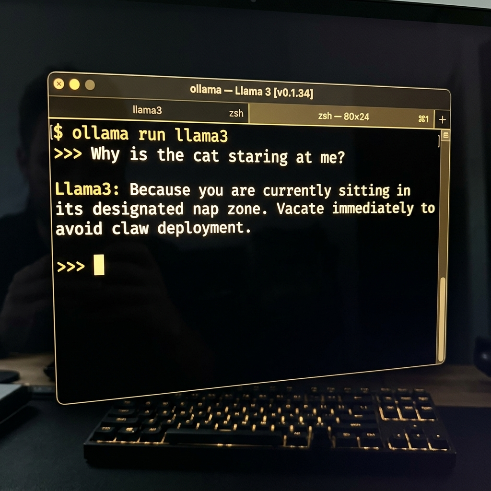

# 🦙 Ollama: Running Powerful AI Models Locally (Offline)

Want to build custom coding assistants, analyze text, or chat with a supercomputer, but don't want to pay external cloud providers a micro-cent per word or let them spy on your top-secret code? Welcome to Ollama! It allows you to download a giant digital brain onto your own machine. It runs completely offline, costs absolutely zero dollars, and keeps your data 100% private. The only side effect is your computer's cooling fan screaming like a jet engine preparing for takeoff.

### 🧭 The 5W 1H of Ollama
*   **Who is this for?** Developers wanting private, free, and offline artificial intelligence models running locally.
*   **What is it?** An open-source tool designed to package, run, and manage Large Language Models (LLMs) directly on your computer.
*   **Where does it run?** Installed locally on your computer's CPU/GPU, completely independent of the internet.
*   **When should you use it?** When you are building private workflows, working in low-connectivity zones, or trying to avoid expensive API paywalls.
*   **Why use it?** Because cloud-based APIs cost money, experience latency/downtime, and expose your source code to external servers.
*   **How does it work?** Download Ollama, run `ollama run <model-name>` (like Llama 3 or Phi 3) in your terminal, and integrate it with your code using local API calls.

---

> [!WARNING]
> Running heavy models locally will make your computer's fans spin like a jet engine taking off. Don't panic if your laptop starts heating up; it's just the AI muscle flexing.

---

## 🗺️ Local Inference vs. Cloud AI

Here is the difference between running models locally via Ollama vs. using standard cloud APIs:

```mermaid
flowchart TD
    subgraph Local Machine (Your Computer)
        AppLocal["💻 Your App Code"] -->|1. Local HTTP Request| Ollama["🦙 Ollama Local Host\nhttp://localhost:11434"]
        Ollama -->|2. Runs on local GPU/RAM| LocalModel["🧠 Local Model\n(e.g., Llama 3 / Phi 3)"]
        LocalModel -->|3. Instant response| AppLocal
    end

    subgraph Cloud Infrastructure
        AppCloud["💻 Your App Code"] -->|1. Over the Internet| OpenAI["☁️ OpenAI / Gemini Cloud API"]
        OpenAI -->|2. Server Farms| CloudModel["🧠 Cloud Model"]
        CloudModel -->|3. Return data| AppCloud
    end

    style LocalModel fill:#00b894,stroke:#00a884,color:#fff
    style CloudModel fill:#74b9ff,stroke:#0984e3,color:#fff
```

---

## 🚀 Step-by-Step Setup Guide

### Step 1: Install Ollama
* **macOS**: Download from [ollama.com](https://ollama.com) or run:
  ```bash
  brew install ollama
  ```
* **Windows & Linux**: Download the installer from the website and run the installer application.

### Step 2: Download & Run a Model
Open your terminal and run the model of your choice. Ollama will automatically download it and open an interactive chat interface:
```bash
ollama run llama3
```
* Or for lightweight laptops, use Microsoft's compact model:
  ```bash
  ollama run phi3
  ```



---

## 💻 Integrating Ollama in Code (JavaScript)

You can communicate with your local model using standard HTTP requests. Here is a quick Node.js script:

```javascript
// index.js - Querying Ollama locally
async function askLocalAI(prompt) {
    const response = await fetch('http://localhost:11434/api/generate', {
        method: 'POST',
        headers: { 'Content-Type': 'application/json' },
        body: JSON.stringify({
            model: 'llama3',
            prompt: prompt,
            stream: false
        })
    });
    
    const data = await response.json();
    console.log("AI Response:", data.response);
}

askLocalAI("Write a simple motor speed capped logic in C++");
```

---

## 🕹️ AI Development Dashboard

Explore related tools to connect your local models:

<div align="center" style="margin: 20px 0;">
  <a href="file:///Users/bharathkumara/Desktop/guides/antigravity.md" style="text-decoration:none;">
    <button style="background-color:#6c5ce7; color:white; border:none; padding:10px 18px; font-size:14px; border-radius:6px; cursor:pointer; font-weight:bold; margin:5px; box-shadow: 0 2px 4px rgba(0,0,0,0.1);">
      👾 Antigravity Agent Guide
    </button>
  </a>
  <a href="file:///Users/bharathkumara/Desktop/guides/api keys.md" style="text-decoration:none;">
    <button style="background-color:#0984e3; color:white; border:none; padding:10px 18px; font-size:14px; border-radius:6px; cursor:pointer; font-weight:bold; margin:5px; box-shadow: 0 2px 4px rgba(0,0,0,0.1);">
      🔑 Secret Keys Vault
    </button>
  </a>
</div>

## 🛠️ Interactive Hands-on Challenge: Chat with a Local Model

Let's check if you can communicate with a local LLM:
1. Open your computer terminal. Run this diagnostics command to see if Ollama is running:
   ```bash
   curl http://localhost:11434
   ```
   *(It should output `"Ollama is running"`)*.
2. If it's running, run a lightweight model in the background:
   ```bash
   ollama run phi3
   ```
3. Open **Antigravity Chat** and prompt the assistant:
   > *"Antigravity, write a Node.js script in `scratch/test_ollama.js` that makes a POST request to my local Ollama server endpoint at http://localhost:11434/api/generate requesting the 'phi3' model to answer: 'Why do programmers wear glasses?' with stream set to false. Run the script and show me the response."*
4. **Verify**: Ensure the script runs successfully and you see the joke output printed locally!

---

### 👤 Author Details
* **Name**: Bharath Kumar A
* **GitHub**: [@bharathkumar000](https://github.com/bharathkumar000)
* **Email**: bharathece2006@gmail.com
