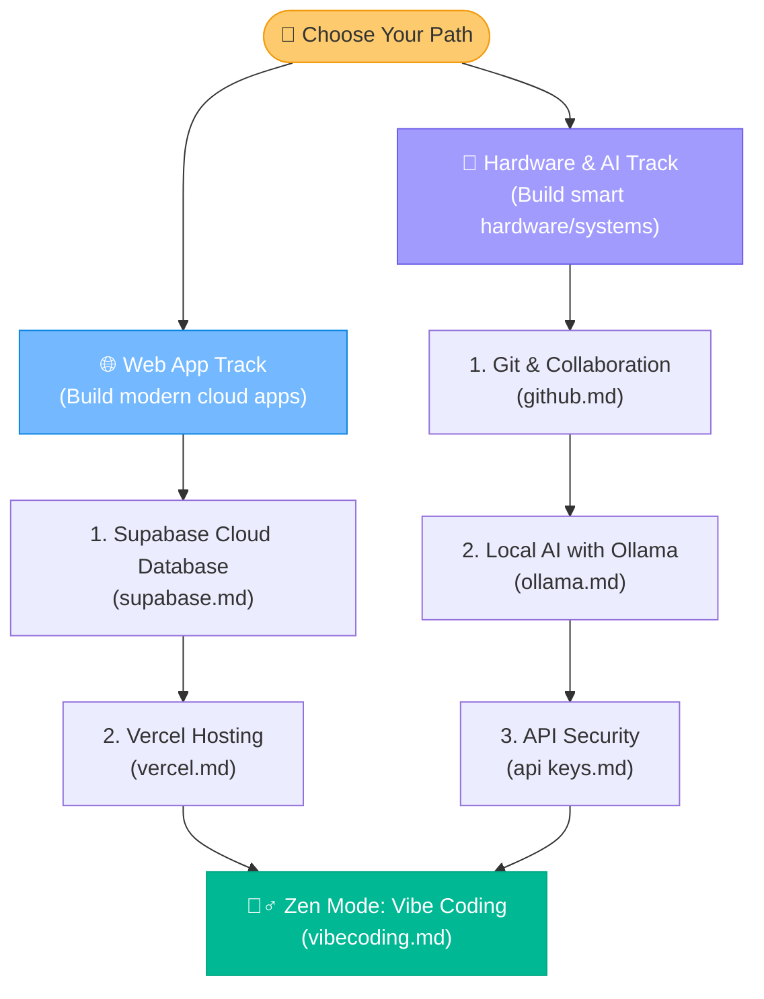

# 📚 The Ultimate Modern Developer Guide Hub

Welcome to the **Developer & Robotics Team Resource Portal**! This is your one-stop-shop master directory for learning modern development technologies, building cloud-connected applications, deploying databases, running local AI models, and mastering collaborative Git workflows.

These guides are optimized for absolute beginners and built to work seamlessly with **Antigravity**, your agentic AI coding assistant.

---

## 🗺️ Recommended Learning Paths

Which adventure are you embarking on today? Follow the roadmap to choose the right guides for your journey:

---

## 📁 Library Directory

Select a guide below to jump straight in:

| Guide Name | Status | Difficulty | Key Topics Covered |
| :--- | :---: | :---: | :--- |
| [🧘‍♂️ Vibe Coding](file:///Users/bharathkumara/Desktop/guides/vibecoding.md) | Ready | 🌟 Easy | How to let AI do the work while you enjoy coffee. |
| [🎓 Git & GitHub](file:///Users/bharathkumara/Desktop/guides/github.md) | Ready | 🌟🌟 Medium | Repositories, branches, PR reviews, merge conflicts. |
| [👾 Antigravity](file:///Users/bharathkumara/Desktop/guides/antigravity.md) | Ready | 🌟 Easy | Prompt engineering, delegating terminal tasks, and AI loops. |
| [⚡ Supabase](file:///Users/bharathkumara/Desktop/guides/supabase.md) | Ready | 🌟🌟 Medium | SQL tables, Authentication, Row-Level Security (RLS). |
| [☁️ Vercel Deployment](file:///Users/bharathkumara/Desktop/guides/vercel.md) | Ready | 🌟 Easy | Auto-deploys, custom domains, environment configurations. |
| [🦙 Ollama Local LLMs](file:///Users/bharathkumara/Desktop/guides/ollama.md) | Ready | 🌟🌟 Medium | Running models offline (Llama 3, Phi 3), local coding. |
| [🔑 API Keys Security](file:///Users/bharathkumara/Desktop/guides/api keys.md) | Ready | 🌟🌟 Medium | Secret management, `.env` setup, security audits. |

---

## 🕹️ Quick Access Dashboard

Click one of the buttons below to open a guide immediately inside your editor:

  <a href="file:///Users/bharathkumara/Desktop/guides/vibecoding.md" style="text-decoration:none;">
    <button style="background-color:#6c5ce7; color:white; border:none; padding:10px 18px; font-size:14px; border-radius:6px; cursor:pointer; font-weight:bold; margin:5px; box-shadow: 0 2px 4px rgba(0,0,0,0.1);">
      🧘‍♂️ Vibe Coding
    </button>
  </a>
  <a href="file:///Users/bharathkumara/Desktop/guides/github.md" style="text-decoration:none;">
    <button style="background-color:#0984e3; color:white; border:none; padding:10px 18px; font-size:14px; border-radius:6px; cursor:pointer; font-weight:bold; margin:5px; box-shadow: 0 2px 4px rgba(0,0,0,0.1);">
      🎓 Git & GitHub
    </button>
  </a>
  <a href="file:///Users/bharathkumara/Desktop/guides/vercel.md" style="text-decoration:none;">
    <button style="background-color:#00cec9; color:white; border:none; padding:10px 18px; font-size:14px; border-radius:6px; cursor:pointer; font-weight:bold; margin:5px; box-shadow: 0 2px 4px rgba(0,0,0,0.1);">
      ☁️ Vercel
    </button>
  </a>
  <a href="file:///Users/bharathkumara/Desktop/guides/supabase.md" style="text-decoration:none;">
    <button style="background-color:#e17055; color:white; border:none; padding:10px 18px; font-size:14px; border-radius:6px; cursor:pointer; font-weight:bold; margin:5px; box-shadow: 0 2px 4px rgba(0,0,0,0.1);">
      ⚡ Supabase
    </button>
  </a>

---

> [!TIP]
> **Pro-Tip**: When reading these guides, keep **Antigravity** open! If there is a code block or command you want to test, simply highlight it and ask Antigravity: *"Create a file with this code and run it in my terminal."*

---

### 👤 Author Details
* **Name**: Bharath Kumar A
* **GitHub**: [@bharathkumar000](https://github.com/bharathkumar000)
* **Email**: bharathece2006@gmail.com
