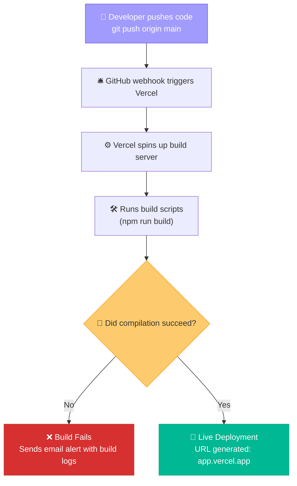

# ☁️ Vercel: Deploying Web Applications Instantly to the Cloud

You have built a beautiful web application on your local machine. Now, you want your users, clients, or friends to visit it. 

### ❌ The Old Way:
You send them a compressed `.zip` folder over Slack, write a 10-step readme file explaining how to install Node.js, run `npm install`, open terminals, and run local hosts. They get confused, run into OS errors, and give up.

### ✅ The Vercel Way:
You push your changes to GitHub, Vercel automatically compiles your build, and generates a live, public URL (like `my-cool-app.vercel.app`) in 60 seconds. Every single commit you make automatically builds a **preview version** of your changes, so you can test adjustments before merging them to production.

---

## 🗺️ The Git-to-Cloud Pipeline

Vercel acts as a listener on your GitHub repository. Every push kicks off the following pipeline:



---

## 🚀 Step-by-Step Deployment Guide

### Step 1: Push Your Code to GitHub
Ensure all your files are committed and uploaded to your remote repository:
```bash
git add .
git commit -m "Finish initial app prototype"
git push origin main
```

### Step 2: Import Project on Vercel
1. Go to [vercel.com](https://vercel.com) and log in using your GitHub account.
2. Click **"Add New"** → **"Project"** on your dashboard.
3. Find your repository list and click **"Import"** next to `team-robot-project`.

### Step 3: Add Your Secrets (Crucial!)
Before clicking deploy, toggle the **"Environment Variables"** dropdown and add the API keys your app needs (like the Supabase keys from your local `.env` file):
* **Key:** `SUPABASE_URL` | **Value:** `https://your-url.supabase.co`
* **Key:** `SUPABASE_ANON_KEY` | **Value:** `your-anon-key`

> [!IMPORTANT]
> This is where your code accesses the secrets securely in production without putting them in the GitHub repo!

### Step 4: Click Deploy!
Click **"Deploy"**. Vercel will start building your code. Once complete, you will see a confetti animation and your live website link!

---

## 🕹️ Operations Dashboard

Where to proceed from here? Click the buttons to configure other modules:

<div align="center" style="margin: 20px 0;">
  <a href="file:///Users/bharathkumara/Desktop/guides/webdev.md" style="text-decoration:none;">
    <button style="background-color:#00b894; color:white; border:none; padding:10px 18px; font-size:14px; border-radius:6px; cursor:pointer; font-weight:bold; margin:5px; box-shadow: 0 2px 4px rgba(0,0,0,0.1);">
      🌐 Design Your Frontend
    </button>
  </a>
  <a href="file:///Users/bharathkumara/Desktop/guides/api%20keys.md" style="text-decoration:none;">
    <button style="background-color:#e17055; color:white; border:none; padding:10px 18px; font-size:14px; border-radius:6px; cursor:pointer; font-weight:bold; margin:5px; box-shadow: 0 2px 4px rgba(0,0,0,0.1);">
      🔑 Check Environment Secrets
    </button>
  </a>
</div>

---

### 👤 Author Details
* **Name**: Bharath Kumar A
* **GitHub**: [@bharathkumar000](https://github.com/bharathkumar000)
* **Email**: bharathece2006@gmail.com
