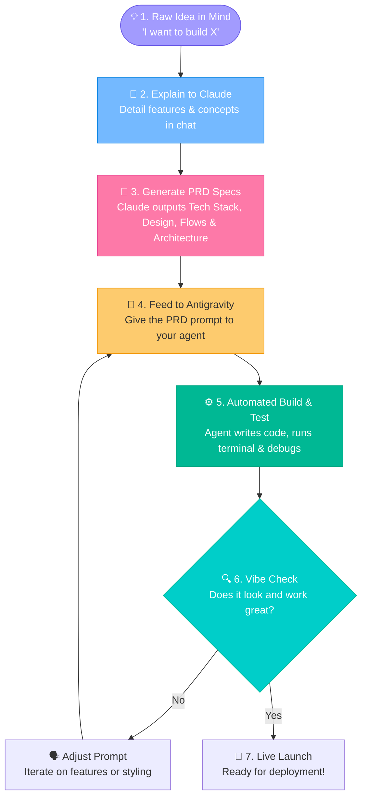
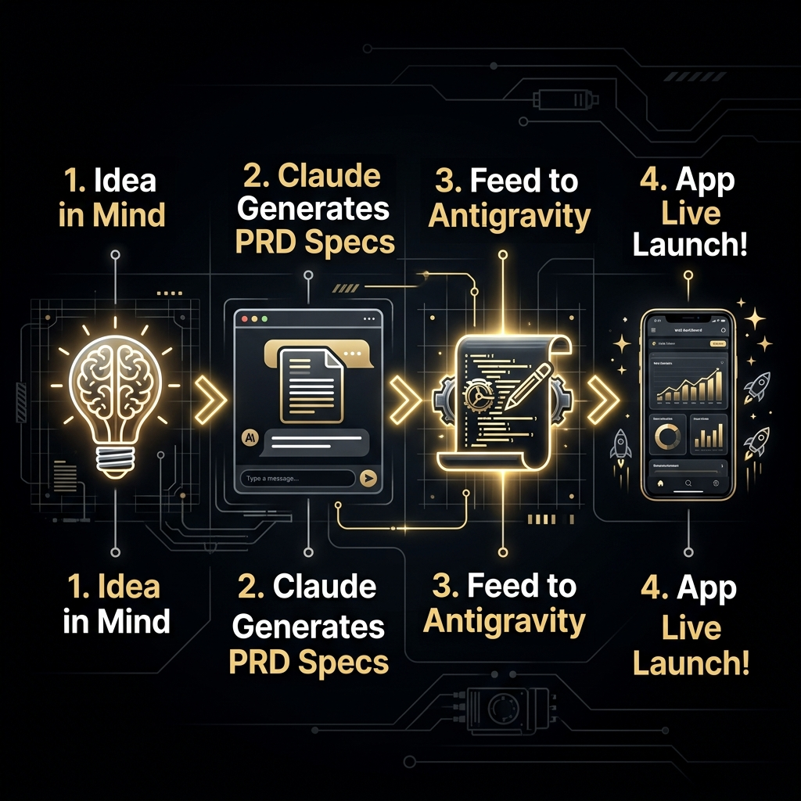

# 🧘‍♂️ The Zen of Vibe Coding: Let the AI Do the Heavy Lifting

Remember that time you tried to write a simple website, but ended up rocking back and forth in the corner of your room because a single missing semicolon broke the entire layout? Vibe Coding is your ultimate escape. Instead of wrestling with syntax errors, package managers, and compiler complaints, you sit back in your comfy chair, sip a hot beverage, and dictate your high-level desires to an AI assistant that handles all the sweating for you.

### 🧭 The 5W 1H of Vibe Coding
*   **Who is this for?** Stressed-out developers who want to transition from code-monkeys to high-level directors of technology.
*   **What is it?** Programming at the speed of thought by communicating your design and architectural intent rather than typing boilerplate syntax.
*   **Where does it happen?** Right within your Antigravity workspace, where natural language meets automated execution.
*   **When should you use it?** Whenever you want to prototype ideas quickly, explore design options, or avoid standard developer fatigue.
*   **Why does it matter?** Because your brain was built for creative problem-solving and logic architecture, not for hunting down missing curly braces in the dark.
*   **How do you do it?** Describe your end goal in plain English, let the AI generate/test the files, perform rapid "Vibe Checks", and guide the design iteratively.

---

## 🗺️ The Vibe Coding Lifecycle: From Mind to Code

Here is the exact practical pipeline of how you take a raw lightbulb idea from your mind and turn it into a working application:

1. **Initiate the Idea**: You get a flash of inspiration for a new project in your mind.
2. **Draft the Specs with Claude**: Instead of trying to write code immediately, you go to Claude (or another chat-based LLM), explain your raw ideas in natural language, and ask it to generate a comprehensive **Project Requirements Document (PRD)**. This PRD should contain everything: the technology stack, user flows, interface designs, content structure, system architecture charts, and a detailed step-by-step flow of work.
3. **Get the Prompt Payload**: Claude processes your thoughts and generates a highly detailed text specification or a copy-paste prompt payload.
4. **Feed it to Antigravity**: You pass this generated specification/prompt directly into **Antigravity**. (Make sure to read the [Antigravity Guide](antigravity.md) to understand how to delegate tasks and collaborate with your agentic helper).
5. **Agent Execution**: Antigravity acts on the requirements document—generating files, setting up configurations, running compiler/linter tools, and launching the local server.
6. **Vibe Check & Iterate**: Run a local vibe check on the preview build, refine the design or prompt requirements, and let Antigravity tweak the layouts.

---

## 🎭 A Humorous Example: The "Cat Translator 3000"

To understand the difference, let’s look at a developer attempting to build a Cat Translator application (translates meows into human food demands).

### ❌ The Old-School Way (No Vibe, Pure Struggle)
1. **Hour 1:** Install Node.js. Discover your version of Node is incompatible with your system. Spend 2 hours fixing homebrew.
2. **Hour 4:** Setup a React boilerplate. It crashes because of a dependency mismatch in `package.json`.
3. **Hour 6:** Finally write the input box. Spend 3 hours debugging why CSS Flexbox won't center a button.
4. **Result:** Exasperation. No actual meow translation logic has been written.

###  The Vibe Coding Way (Zen & Flow)
1. **You ask Antigravity:** 
   > *"Hey Antigravity, create a Next.js web application for a 'Cat Translator'. Make it look premium, dark mode, with a button that plays a meow sound and displays a random translation like 'Feed me salmon, peasant'. Deploy a local server so I can see it."*
2. **Antigravity:** Automatically installs dependencies, writes the components, configures Tailwind CSS, builds the UI, fixes a TypeScript type error, and launches the local dev server.
3. **Your contribution:** Pressing the spacebar to approve the commands, sipping your tea, and saying, *"Nice. Now make the text glow green."*

---

## 🕹️ Try It Now (Interactive Vibe Dashboard)

Click below to navigate directly to your tools and start vibe coding:

  <a href="file:///Users/bharathkumara/Desktop/guides/antigravity.md" style="text-decoration:none;">
    <button style="background-color:#6c5ce7; color:white; border:none; padding:12px 24px; font-size:16px; border-radius:8px; cursor:pointer; font-weight:bold; box-shadow: 0 4px 6px rgba(0,0,0,0.1); margin:10px;">
      👾 Open Antigravity Guide
    </button>
  </a>
  <a href="file:///Users/bharathkumara/Desktop/guides/webdev.md" style="text-decoration:none;">
    <button style="background-color:#00b894; color:white; border:none; padding:12px 24px; font-size:16px; border-radius:8px; cursor:pointer; font-weight:bold; box-shadow: 0 4px 6px rgba(0,0,0,0.1); margin:10px;">
      🌐 Explore Web Dev Guide
    </button>
  </a>

---

## 💡 The 3 Commandments of Vibe Coding

1. **Be Specific About the Destination, Not the Road:** Describe exactly what you want the app to look and feel like, rather than telling the AI *how* to write the loop. Let the AI decide the design patterns.
2. **Vibe Check Early and Often:** Don't ask the AI to build a whole operating system at once. Ask for a single page, run a vibe check (test it), then ask for the next feature.
3. **Be the Director, Not the Actor:** Your job is to have taste. If the buttons are misaligned or the layout looks cheap, ask the AI to polish the aesthetics.

---

*This guide is part of the **Modern Developer Guide Series**. Let the vibes guide your code!* 🚀

## 🛠️ Interactive Hands-on Challenge: Build Your First Vibe App

Let's test the vibe lifecycle together:
1. Open **Antigravity Chat**.
2. Copy and send this prompt:
   > *"Antigravity, write a simple Python script in `scratch/joke_generator.py` that contains a list of 5 funny programming jokes and prints one at random. Run the script in the terminal so I can see the joke."*
3. **Verify**: Check that Antigravity writes the file and runs it to output a joke.
4. **Modify the Vibe**: Send a follow-up request:
   > *"Now change the jokes to be specifically about Git merge conflicts and run it again."*
5. **Verify**: Check the new terminal output to confirm the jokes updated!

---

### 👤 Author Details
* **Name**: Bharath Kumar A
* **GitHub**: [@bharathkumar000](https://github.com/bharathkumar000)
* **Email**: bharathece2006@gmail.com
