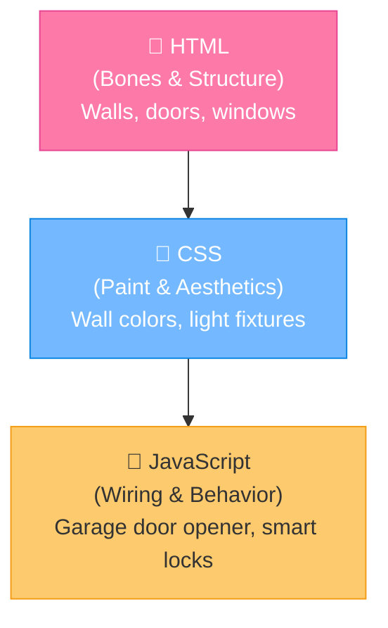

# 🌐 Web Development Core: HTML, CSS & JavaScript Foundations

Building for the web can feel overwhelming at first. You hear about frameworks like React, Next.js, Angular, Svelte, and Vue before you even understand how a basic web page works. 

This guide strips away the buzzwords and focuses on the three core languages that run inside every web browser on Earth: **HTML**, **CSS**, and **JavaScript**.

---

## 🗺️ How the Trio Works Together

Think of a web page as a house:



* **HTML (HyperText Markup Language)**: Defines the elements on the page. E.g., *"This is a paragraph, this is a button, this is an image."* Without CSS, HTML looks like a 90's text document.
* **CSS (Cascading Style Sheets)**: Controls the layouts, fonts, sizes, colors, and styling. E.g., *"Center this button, make the background dark gray, and make the text glow green."*
* **JavaScript**: Adds logic, states, animations, calculations, and handles database connections. E.g., *"When the user clicks the button, fetch data from Supabase and show a success notification."*

---

## 🛠️ Build Your First Interactive Element: The Click Counter

Here is a complete, beginner-friendly example of an interactive card that counts how many times you click it.

```html
<!-- index.html -->
<!DOCTYPE html>
<html lang="en">
<head>
    <meta charset="UTF-8">
    <title>Vibe Counter</title>
    <style>
        /* CSS: Aesthetics */
        body {
            background-color: #1a1a1a;
            color: #ffffff;
            font-family: Arial, sans-serif;
            display: flex;
            justify-content: center;
            align-items: center;
            height: 100vh;
            margin: 0;
        }
        .card {
            background-color: #2b2b2b;
            padding: 30px;
            border-radius: 12px;
            box-shadow: 0 8px 16px rgba(0,0,0,0.3);
            text-align: center;
        }
        button {
            background-color: #00b894;
            color: white;
            border: none;
            padding: 12px 24px;
            font-size: 16px;
            font-weight: bold;
            border-radius: 6px;
            cursor: pointer;
            transition: background 0.2s;
        }
        button:hover {
            background-color: #00a884;
        }
    </style>
</head>
<body>

    <!-- HTML: Structure -->
    <div class="card">
        <h1>Vibe Counter</h1>
        <p>Total Clicks: <span id="count-value">0</span></p>
        <button id="vibe-btn">Boost Vibes 🚀</button>
    </div>

    <!-- JavaScript: Brains -->
    <script>
        let count = 0;
        const countSpan = document.getElementById("count-value");
        const button = document.getElementById("vibe-btn");

        button.addEventListener("click", () => {
            count++;
            countSpan.textContent = count;
            
            // Humorous easter egg
            if (count === 10) {
                alert("Whoa, your vibes are reaching critical mass! 🌟");
            }
        });
    </script>
</body>
</html>
```

---

## 🕹️ Frontend Control Panel

Ready to launch this to the cloud or save state? Click below to navigate:

<div align="center" style="margin: 20px 0;">
  <a href="file:///Users/bharathkumara/Desktop/guides/supabase.md" style="text-decoration:none;">
    <button style="background-color:#e17055; color:white; border:none; padding:10px 18px; font-size:14px; border-radius:6px; cursor:pointer; font-weight:bold; margin:5px; box-shadow: 0 2px 4px rgba(0,0,0,0.1);">
      ⚡ Connect to Supabase
    </button>
  </a>
  <a href="file:///Users/bharathkumara/Desktop/guides/vercel.md" style="text-decoration:none;">
    <button style="background-color:#0984e3; color:white; border:none; padding:10px 18px; font-size:14px; border-radius:6px; cursor:pointer; font-weight:bold; margin:5px; box-shadow: 0 2px 4px rgba(0,0,0,0.1);">
      ☁️ Deploy to Vercel
    </button>
  </a>
</div>

---

### 👤 Author Details
* **Name**: Bharath Kumar A
* **GitHub**: [@bharathkumar000](https://github.com/bharathkumar000)
* **Email**: bharathece2006@gmail.com
